# COURSE PROJECT

---

<p align="center">
    <strong>Universidad Peruana de Ciencias Aplicadas</strong><br>
    </img><br>
    <strong>Ingeniería de Software</strong><br>
    <strong>2025-02</strong><br>
    <strong>Desarrollo de Soluciones IOT</strong><br>
    <strong>Docente: Marco Antonio Leon Baca</strong><br>
    <br>TP1</br>
</p>

<p align="center">
    <strong>Startup: ecoTech</strong><br>
    <strong>Producto: MUEVETE!</strong>
</p>

### Team Members:

<div style="align:center;display: flex; justify-content: center; align-items: center;">

| **Code**    | **Member**                          |
|-------------|-------------------------------------|
| u202115590  | Onofre Ruiz, Carlos Jesus      	    |
| u20211a789  | Travezaño Patiño, Eduard Gedeon     |
| u20201f140  | Mendez Vargas, Sebastian Orlando    |
| u202213222  | Hidalgo Lopez, Mathias Adriano      |

</div>

<p align="center">
    <strong>Septiembre 2025</strong>
</p>

---

# Registro de Versiones del Informe

 __TB1__

Para el desarrollo de la entrega **TB1**, se optó por dividir el trabajo de la siguiente forma:

| **Versión**  | **Fecha**  | **Autor**                         | **Descripción**                                                                                                   |
|--------------|------------|-----------------------------------|-------------------------------------------------------------------------------------------------------------------|
|**#01 - TB1**| 09/09/25   |      |  |
|**#01 - TB1**| 09/09/25   |      |  |
|**#01 - TB1**| 10/09/25   |      |  |
|**#01 - TB1**| 08/09/25   |      |  |
|**#01 - TB1**| 10/09/25   |      |  |

# Contenido

## Tabla de contenidos
- [COURSE PROJECT](#course-project)
    - [Team Members:](#team-members)
- [Registro de Versiones del Informe](#registro-de-versiones-del-informe)
- [Contenido](#contenido)
  - [Tabla de contenidos](#tabla-de-contenidos)
- [Studen Outcome](#studen-outcome)
- [**Capítulo I: Introducción.**](#capítulo-i-introducción)
  - [**1.1. Startup Profile.**](#11-startup-profile)
    - [**1.1.1. Descripción de la Startup.**](#111-descripción-de-la-startup)
    - [**1.1.2. Perfiles de integrantes del equipo.**](#112-perfiles-de-integrantes-del-equipo)
  - [**1.2. Solution Profile.**](#12-solution-profile)
    - [**1.2.1. Antecedentes y problemática.**](#121-antecedentes-y-problemática)
    - [**1.2.2. Lean UX Process.**](#122-lean-ux-process)
      - [**1.2.2.1. Lean UX Problem Statements.**](#1221-lean-ux-problem-statements)
      - [**1.2.2.2. Lean UX Assumptions.**](#1222-lean-ux-assumptions)
      - [**1.2.2.3. Lean UX Hypothesis Statements.**](#1223-lean-ux-hypothesis-statements)
      - [**1.2.2.4. Lean UX Canvas.**](#1224-lean-ux-canvas)
  - [**1.3. Segmentos objetivo.**](#13-segmentos-objetivo)

- [**Capítulo II: Requirements Elicitation & Analysis.**](#capítulo-ii-requirements-elicitation--analysis)
  - [**2.1. Competidores.**](#21-competidores)
    - [**2.1.1. Análisis competitivo.**](#211-análisis-competitivo)
    - [**2.1.2. Estrategias y tácticas frente a competidores.**](#212-estrategias-y-tácticas-frente-a-competidores)
  - [**2.2. Entrevistas.**](#22-entrevistas)
    - [**2.2.1. Diseño de entrevistas.**](#221-diseño-de-entrevistas)
    - [**2.2.2. Registro de entrevistas.**](#222-registro-de-entrevistas)
    - [**2.2.3. Análisis de entrevistas.**](#223-análisis-de-entrevistas)
  - [**2.3. Needfinding.**](#23-needfinding)
    - [**2.3.1. User Personas.**](#231-user-personas)
    - [**2.3.2. User Task Matrix.**](#232-user-task-matrix)
    - [**2.3.3. User Journey Mapping.**](#233-user-journey-mapping)
    - [**2.3.4. Empathy Mapping.**](#234-empathy-mapping)
  - [**2.4. Big Picture EventStorming.**](#24-big-picture-eventstorming)
  - [**2.5. Ubiquitous Language.**](#25-ubiquitous-language)

- [**Capítulo III: Requirements Specification.**](#capítulo-iii-requirements-specification)
  - [**3.1. User Stories.**](#31-user-stories)
  - [**3.2. Impact Mapping.**](#32-impact-mapping)
  - [**3.3. Product Backlog.**](#33-product-backlog)

- [**Capítulo IV: Solution Software Design.**](#capítulo-iv-solution-software-design)
  - [**4.1. Strategic-Level Domain-Driven Design.**](#41-strategic-level-domain-driven-design)
    - [**4.1.1. Design-Level EventStorming.**](#411-design-level-eventstorming)
      - [**4.1.1.1. Candidate Context Discovery.**](#4111-candidate-context-discovery)
      - [**4.1.1.2. Domain Message Flows Modeling.**](#4112-domain-message-flows-modeling)
      - [**4.1.1.3. Bounded Context Canvases.**](#4113-bounded-context-canvases)
    - [**4.1.2. Context Mapping.**](#412-context-mapping)
    - [**4.1.3. Software Architecture.**](#413-software-architecture)
      - [**4.1.3.1. Software Architecture System Landscape Diagram.**](#4131-software-architecture-system-landscape-diagram)
      - [**4.1.3.2. Software Architecture Context Level Diagrams.**](#4132-software-architecture-context-level-diagrams)
      - [**4.1.3.3. Software Architecture Container Level Diagrams.**](#4133-software-architecture-container-level-diagrams)
      - [**4.1.3.4. Software Architecture Deployment Diagrams.**](#4134-software-architecture-deployment-diagrams)
  - [**4.2. Tactical-Level Domain-Driven Design.**](#42-tactical-level-domain-driven-design)
    - [**4.2.1. Bounded Context: <Bounded Context Name>.**](#42x-bounded-context-bounded-context-name)
      - [**4.2.1.1. Domain Layer.**](#42x1-domain-layer)
      - [**4.2.1.2. Interface Layer.**](#42x2-interface-layer)
      - [**4.2.1.3. Application Layer.**](#42x3-application-layer)
      - [**4.2.1.4. Infrastructure Layer.**](#42x4-infrastructure-layer)
      - [**4.2.1.5. Bounded Context Software Architecture Component Level Diagrams.**](#42x5-bounded-context-software-architecture-component-level-diagrams)
      - [**4.2.1.6. Bounded Context Software Architecture Code Level Diagrams.**](#42x6-bounded-context-software-architecture-code-level-diagrams)
        - [**4.2.1.6.1. Bounded Context Domain Layer Class Diagrams.**](#42x61-bounded-context-domain-layer-class-diagrams)
        - [**4.2.1.6.2. Bounded Context Database Design Diagram.**](#42x62-bounded-context-database-design-diagram)

- [**Capítulo V: Solution UI/UX Design.**](#capítulo-v-solution-uiux-design)
  - [**5.1. Style Guidelines.**](#51-style-guidelines)
    - [**5.1.1. General Style Guidelines.**](#511-general-style-guidelines)
    - [**5.1.2. Web, Mobile and IoT Style Guidelines.**](#512-web-mobile-and-iot-style-guidelines)
  - [**5.2. Information Architecture.**](#52-information-architecture)
    - [**5.2.1. Organization Systems.**](#521-organization-systems)
    - [**5.2.2. Labeling Systems.**](#522-labeling-systems)
    - [**5.2.3. SEO Tags and Meta Tags.**](#523-seo-tags-and-meta-tags)
    - [**5.2.4. Searching Systems.**](#524-searching-systems)
    - [**5.2.5. Navigation Systems.**](#525-navigation-systems)
  - [**5.3. Landing Page UI Design.**](#53-landing-page-ui-design)
    - [**5.3.1. Landing Page Wireframe.**](#531-landing-page-wireframe)
    - [**5.3.2. Landing Page Mock-up.**](#532-landing-page-mock-up)
  - [**5.4. Applications UX/UI Design.**](#54-applications-uxui-design)
    - [**5.4.1. Applications Wireframes.**](#541-applications-wireframes)
    - [**5.4.2. Applications Wireflow Diagrams.**](#542-applications-wireflow-diagrams)
    - [**5.4.3. Applications Mock-ups.**](#543-applications-mock-ups)
    - [**5.4.4. Applications User Flow Diagrams.**](#544-applications-user-flow-diagrams)
  - [**5.5. Applications Prototyping.**](#55-applications-prototyping)

- [**Capítulo VI: Product Implementation, Validation & Deployment.**](#capítulo-vi-product-implementation-validation--deployment)
  - [**6.1. Software Configuration Management.**](#61-software-configuration-management)
    - [**6.1.1. Software Development Environment Configuration.**](#611-software-development-environment-configuration)
    - [**6.1.2. Source Code Management.**](#612-source-code-management)
    - [**6.1.3. Source Code Style Guide & Conventions.**](#613-source-code-style-guide--conventions)
    - [**6.1.4. Software Deployment Configuration.**](#614-software-deployment-configuration)
  - [**6.2. Landing Page, Services & Applications Implementation.**](#62-landing-page-services--applications-implementation)
    - [**6.2.1. Sprint 1.**](#621-sprint-1)
      - [**6.2.1.1. Sprint Planning 1.**](#6211-sprint-planning-1)
      - [**6.2.1.2. Aspect Leaders and Collaborators.**](#6212-aspect-leaders-and-collaborators)
      - [**6.2.1.3. Sprint Backlog 1.**](#6213-sprint-backlog-1)
      - [**6.2.1.4. Development Evidence for Sprint Review.**](#6214-development-evidence-for-sprint-review)
      - [**6.2.1.5. Testing Suite Evidence for Sprint Review.**](#6215-testing-suite-evidence-for-sprint-review)
      - [**6.2.1.6. Execution Evidence for Sprint Review.**](#6216-execution-evidence-for-sprint-review)
      - [**6.2.1.7. Services Documentation Evidence for Sprint Review.**](#6217-services-documentation-evidence-for-sprint-review)
      - [**6.2.1.8. Software Deployment Evidence for Sprint Review.**](#6218-software-deployment-evidence-for-sprint-review)
      - [**6.2.1.9. Team Collaboration Insights during Sprint.**](#6219-team-collaboration-insights-during-sprint)
  - [**6.3. Validation Interviews.**](#63-validation-interviews)
    - [**6.3.1. Diseño de Entrevistas.**](#631-diseño-de-entrevistas)
    - [**6.3.2. Registro de Entrevistas.**](#632-registro-de-entrevistas)
    - [**6.3.3. Evaluaciones según heurísticas.**](#633-evaluaciones-según-heurísticas)
  - [**6.4. Video About-the-Product.**](#64-video-about-the-product)

- [**Conclusiones y Recomendaciones.**](#conclusiones-y-recomendaciones)
- [**Video About-the-Team.**](#video-about-the-team)
- [**Bibliografía.**](#bibliografía)
- [**Anexos.**](#anexos)

### **Student Outcome**

| Criterio específico | Acciones realizadas | Conclusiones |
| :--- | :--- | :--- |
| Trabaja en equipo para proporcionar liderazgo en forma conjunta | **Onofre Ruiz, Carlos Jesus - TB1:** Aportó en el desarrollo del capítulo 4.<br>**Hidalgo Lopez, Mathias Adriano - TB1:** Condujo entrevistas y modificó documentos del proyecto (Trello, diagramas). <br>**Travezaño Patiño, Eduard Gedeon - TB1:** Realizó entrevistas, elaboró el PPT y ajustó la documentación.<br>**Mendez Vargas, Sebastian Orlando - TB1:** Colaboró en el desarrollo del capítulo 4. <br><br>**Onofre Ruiz, Carlos Jesus - TP1:** Participe activamente en la validación y revisión del producto, liderando las actividades de pruebas, ejecución y documentación de servicios. Además, contribuyó a la revisión de evidencias del Sprint, promoviendo la colaboración y asegurando la calidad de los entregables. <br>**Hidalgo Lopez, Mathias Adriano - TP1:** Aporte liderazgo en el área de diseño y despliegue de interfaces, siendo responsable de la primera versión de la Landing Page y del Frontend Web Application. Asimismo, elaboró el Capítulo V: Solution UI/UX Design, donde definió lineamientos visuales y funcionales que guiaron al equipo en el desarrollo del producto. <br>**Travezaño Patiño, Eduard Gedeon - TP1:** Asumió un rol de liderazgo técnico dentro del equipo, siendo responsable de la configuración del entorno de desarrollo, la gestión del código fuente y la definición de las convenciones de estilo. Además, lideró la implementación de la Landing Page, los servicios y las aplicaciones, guiando al equipo en la configuración de despliegue y asegurando la correcta integración del software. <br>**Mendez Vargas, Sebastian Orlando - TP1:** Lideró el desarrollo del primer Sprint, planificando las actividades, estableciendo prioridades y definiendo el Sprint Backlog. También se encargó de coordinar la asignación de tareas a los colaboradores y de presentar las evidencias del desarrollo durante la revisión del Sprint, mostrando habilidades de liderazgo y organización. | **TB1:** El equipo demostró una fuerte sinergia y liderazgo compartido, donde cada miembro asumió la responsabilidad de sus tareas asignadas para contribuir al objetivo común del entregable. <br>**TP1:** El equipo demostró un liderazgo compartido y una coordinación efectiva en la ejecución del proyecto. La comunicación constante y la distribución equilibrada de responsabilidades permitieron integrar exitosamente todas las etapas de desarrollo, fortaleciendo el trabajo en equipo y la toma de decisiones colaborativas.|
| Crea un entorno colaborativo e inclusivo, establece metas, planifica tareas y cumple objetivos. | **Onofre Ruiz, Carlos Jesus - TB1:** Cumplió con el objetivo de desarrollar el capítulo 4.<br>**Hidalgo Lopez, Mathias Adriano - TB1:** Cumplió con la tarea de realizar entrevistas y documentar el Student Outcome.<br>**Travezaño Patiño, Eduard Gedeon - TB1:** Cumplió el objetivo de realizar entrevistas y preparar la presentación.<br>**Mendez Vargas, Sebastian Orlando - TB1:** Logró el objetivo de completar su parte del capítulo 4.<br><br>**Onofre Ruiz, Carlos Jesus - TP1:** Contribui al entorno colaborativo al documentar los procesos de prueba, ejecución y despliegue, compartiendo los resultados con el equipo para mejorar la calidad del producto. <br>**Hidalgo Lopez, Mathias Adriano - TP1:** Fortaleci el trabajo conjunto mediante el diseño de la interfaz y la implementación de la primera versión del Frontend, alineando los objetivos visuales y funcionales del equipo y aporte en el diseño UI/UX para que todos los miembros compartieran una visión común del producto final.<br>**Travezaño Patiño, Eduard Gedeon - TP1:** Fomente un entorno colaborativo al definir claramente las configuraciones de desarrollo y despliegue, facilitando que todos los integrantes pudieran trabajar bajo las mismas condiciones técnicas. <br>**Mendez Vargas, Sebastian Orlando - TP1:** promovi la organización del equipo mediante la planificación del Sprint 1, estableciendo objetivos claros y asegurando que las tareas fueran asignadas de forma equitativa. | **TB1:** Se logró un entorno de trabajo colaborativo y eficaz. La planificación de tareas fue clara y cada integrante cumplió con sus objetivos asignados, lo que permitió alcanzar la meta general del entregable (TB1) de manera exitosa. <br>**TP1:** Se logró un entorno colaborativo e inclusivo, basado en la planificación clara de tareas y metas. La comunicación, la cooperación y el uso de metodologías ágiles facilitaron el cumplimiento de los objetivos y la entrega de resultados de calidad, reflejando un compromiso conjunto con el éxito del proyecto.|

# [**Capítulo I: Introducción.**](#capítulo-i-introducción)

## [**1.1 Startup Profile.**](#11-startup-profile)

En esta sección, exploraremos la identidad de nuestra startup, presentando una descripción detallada de la empresa y los perfiles de quienes conformamos el equipo.

### [**1.1.1 Descripción del startup.**](#111-descripción-del-startup)

Muevete! es una startup que nace como una iniciativa frente a dos realidades urbanas en pleno auge: la urgente demanda de opciones de movilidad sostenible y la creciente popularidad de los vehículos ecológicos. Nuestra propuesta se materializa en una aplicación que sirve como puente, conectando a personas que necesitan un medio de transporte —como bicicletas, scooters, skateboards o motos eléctricas— con quienes ya poseen estos vehículos y están dispuestos a compartirlos.

Lo que realmente nos distingue en el ecosistema de aplicaciones de movilidad es nuestro doble propósito. No solo defendemos y facilitamos una forma de transporte más limpia y amigable con el planeta, sino que también abrimos una puerta a oportunidades de ingreso para la comunidad universitaria. Los estudiantes pueden generar ganancias de forma flexible, ya sea alquilando o vendiendo sus vehículos. Además, hemos integrado en nuestra plataforma funcionalidades clave para garantizar que cada interacción sea segura, ágil y, sobre todo, una experiencia positiva.

**Misión:** Ser el conector digital que facilita el acceso a una movilidad urbana sostenible. A través de nuestra plataforma, buscamos reducir activamente la huella de carbono en la ciudad, al tiempo que empoderamos a los estudiantes universitarios con nuevas oportunidades económicas.

**Visión:** Aspiramos a consolidarnos como la aplicación de referencia en el ámbito de la movilidad urbana sostenible. Queremos ser reconocidos por democratizar el acceso a vehículos ecológicos y por inspirar un estilo de vida más saludable y en armonía con nuestro entorno.

### [**1.1.2 Perfiles de los integrantes del equipo.**](#112-perfiles-de-los-integrantes-del-equipo)

<table>
  <tr>
    <th>Miembros del equipo</th>
    <th>Descripción</th>
  </tr>
  <tr>
    <td></td>
    <td>Soy Eduard, tengo 20 años y actualmente estoy cursando la carrera de Ingeniería de Software. Considero que soy alguien que se adapta a lo que requiera el trabajo, logrando aportar en este de buena manera, para asegurar un trabajo bien hecho. Con conocimientos en distintos lenguajes de programación como C++, Python, SQL y entre otros. Además mis motivaciones me ayudan a dar lo mejor de mí y mantenerse constante apoyando al equipo en lo que se requiera.</td>
  </tr>
  
   <tr>
    <td></td>
    <td>Soy estudiante de la carrera de ingeniería de software, actualmente cursando el 8to ciclo de carrera. Aunque soy fullstack developer, tengo más inclinación por el desarrollo frontend. Mi stack arranca con Next.js(Framework de React) + Typescript para el front y Node.js + Express.js + MongoDB para el back. Como todo buen programador, me considero un eterno estudiante, por lo que me encuentro en este momento estudiando Docker y Redis..</td>
  </tr>

  <tr>
    <td></td>
    <td>Estudiante de ingeniería de software, tengo varios interes como backend developer, aun asi desempeño roles como desarrollo frontend y diseño UX/UI. Participo activamente en ramas estudiantiles y a la par apoyando a la facultad de Ingenieria. Me encuentro realizando m tesis basado en machine learning siendo un reto para mi que superaré.</td>
    </tr>

  <tr>
    <td></td>
    <td>Mi nombre es Mathias Adriano Hidalgo López, tengo 20 años y actualmente estudio la carrera de Ingeniería de Software. Soy una persona a la que le gusta colaborar y trabajar en equipo, además de ser activa, con compromiso y disciplina. Poseo conocimientos en C++, C#, JavaScript, etc. además de otros conocimientos de programación adquiridos en ciclos anteriores.</td>
  </tr>

</table>

---

## [**1.2. Solution Profile.**](#12-solution-profile)

Esta sección se divide en dos áreas fundamentales:

Contexto y Desafío: Aquí profundizamos en el problema que nuestro proyecto se propone resolver. Detallamos el panorama actual, los elementos cruciales que nuestra solución debe atender, y definimos los objetivos y limitaciones del proyecto.

Proceso Lean UX: En esta parte, aplicamos el marco de trabajo Lean UX para explicar cómo abordaremos la solución del problema desde la perspectiva del modelo de negocio.

### [**1.2.1. Antecedentes y Problemática.**](#121-antecedentes-y-problemática)

### Antecedentes:
En los últimos diez años, el pulso de nuestras ciudades ha cambiado. La forma en que nos movemos está en plena transformación, impulsada por una mayor conciencia ambiental y los avances tecnológicos. Alternativas de transporte ecológicas, como las bicicletas y los scooters eléctricos, han ganado un terreno impresionante, lo que evidencia un deseo colectivo por soluciones de movilidad más inteligentes y responsables.

Para los habitantes de Lima Metropolitana, el transporte urbano no es solo un inconveniente, es uno de los problemas más críticos de su día a día. Se le describe como un sistema informal, ineficiente y de baja calidad, marcado por la inseguridad, altas tasas de accidentes y una contaminación ambiental y sonora alarmante, tal como lo han señalado el MTC (2013) y la OMS.

Frente a esta realidad, la búsqueda de alternativas de movilidad más ágiles, sostenibles y al alcance de todos se ha convertido en una prioridad. Vehículos como bicicletas, scooters, skateboards y motos eléctricas emergen como soluciones prácticas que no solo contribuyen a limpiar el aire que respiramos, sino que también promueven un estilo de vida más activo y saludable.

Paralelamente, existe un desafío económico que afecta directamente a los jóvenes. Según datos de la USIL, la tasa de deserción en la educación superior universitaria aumentó significativamente del 19.3% en 2019 al 23.2% en 2021. Esta cifra sugiere que muchos estudiantes necesitan un respaldo financiero adicional para poder costear y continuar con su formación profesional.

Es en la intersección de estos dos mundos donde encontramos nuestra oportunidad. A la par que crece la demanda de movilidad ecológica, también lo hace la necesidad de ingresos flexibles entre los estudiantes universitarios. En un contexto de costos de vida crecientes y altas exigencias académicas, los jóvenes buscan maneras de ganar dinero que se ajusten a sus horarios, y la economía digital ofrece el espacio perfecto para ello.

Nuestro proyecto busca ser un agente de cambio. Queremos transformar la movilidad en Lima y, al mismo tiempo, empoderar a los universitarios, ofreciéndoles una herramienta digital para generar ingresos de manera autónoma. Al conectar a estudiantes con potenciales usuarios, creamos un ecosistema donde la sostenibilidad y el espíritu emprendedor van de la mano. Nuestra meta es clara: reducir la huella de carbono y fortalecer el bienestar económico de los jóvenes, un viaje a la vez.

### Problemática (5Ws y 2Hs)
**¿Qué? (What):** El núcleo del problema es la ausencia de una plataforma digital que integre la movilidad sostenible con una oportunidad económica real y flexible para los estudiantes. Por un lado, la ciudad de Lima lidia con serios problemas de congestión y contaminación; por otro, los universitarios luchan por encontrar fuentes de ingreso compatibles con su vida académica.

**¿Cuándo? (When):** Esta problemática no es nueva, pero se ha intensificado notablemente en la última década debido al crecimiento urbano desmedido y a la creciente urgencia de adoptar hábitos más sostenibles. La presión económica sobre los estudiantes se ha agudizado con el aumento del costo de vida.

**¿Dónde? (Where):** El epicentro de este desafío es Lima, una metrópoli que sufre de alta congestión vehicular y niveles preocupantes de contaminación. Sin embargo, la necesidad de ingresos flexibles es una realidad que afecta a estudiantes universitarios en todo el país.

**¿Quién? (Who):** Los protagonistas de esta historia son, por un lado, los universitarios que poseen vehículos menores (bicicletas, scooters, etc.) y buscan una forma de monetizarlos. Por otro lado, están los usuarios de la aplicación, un grupo diverso que incluye trabajadores, turistas y residentes de Lima que desean moverse por la ciudad de una manera más económica, eficiente y ecológica.

**¿Por qué? (Why):** La causa fundamental del problema es la falta de una solución unificada. Esta carencia frena el potencial de los universitarios para mejorar su autonomía financiera y, a su vez, limita la capacidad de la ciudad para transitar hacia un modelo de movilidad más limpio y ordenado.

**¿Cómo? (How):** Los usuarios interactuarán con nuestro producto a través de una aplicación web y móvil, diseñada para ser intuitiva y accesible desde cualquier dispositivo con conexión a internet. El descubrimiento de nuestra plataforma se dará de forma orgánica a través de redes sociales, alianzas con universidades, campañas de marketing digital y el boca a boca en comunidades enfocadas en la sostenibilidad. La preferencia será siempre una experiencia de usuario fluida, rápida y que motive la participación.

**¿Cuánto? (How much):** El impacto de este problema es profundo y multifacético. A nivel ambiental, contribuye a que Lima sea una de las ciudades con peor calidad de aire en la región. A nivel social, la congestión vehicular roba a los ciudadanos un promedio de tres horas diarias, afectando su productividad y bienestar. A nivel económico, la falta de ingresos flexibles aumenta el estrés financiero de los estudiantes, un grupo que representa una parte vital de la juventud limeña, mientras que la dependencia del ineficiente transporte público consume una porción considerable de sus ya limitados presupuestos.

### [**1.2.2. Lean UX Process.**](#122-lean-ux-process)

<td></td>

#### [**1.2.2.1. Lean UX Problem Statements.**](#1221-lean-ux-problem-statements)


Nuestro objetivo es crear una plataforma digital que funcione como un punto de encuentro para universitarios con vehículos menores en desuso y personas que buscan activamente alternativas de movilidad más asequibles y respetuosas con el medio ambiente. Hemos identificado que una gran cantidad de estudiantes posee bicicletas, scooters o patinetas sin darles uso, mientras que, simultáneamente, existe un grupo de personas que necesita opciones de transporte económicas y sostenibles. Esta situación refleja una preocupación real por los costos de movilidad, el impacto ecológico y la promoción de un estilo de vida saludable. Por lo tanto, nos preguntamos: 

¿Cómo podemos diseñar una experiencia digital que facilite el intercambio de estos vehículos de forma eficiente, promoviendo así un ecosistema de transporte económico, sostenible y beneficioso para la salud?

### Aspectos

#### Domain:
Movilidad y transporte compartido para estudiantes universitarios.

#### Customer Segments:

- ##### Estudiantes Universitarios
Estudiantes que necesitan desplazarse a sus universidades y buscan una alternativa al transporte público o a los vehículos particulares. Estos estudiantes enfrentan desafíos como el estrés, la inseguridad y el costo elevado del transporte.

- ##### Propietarios de Vehículos Privados
Estudiantes que poseen vehículos y desean compartir sus viajes con otros para reducir gastos en combustible y maximizar el uso de sus vehículos.

#### Pain Points:

- ##### Estudiantes

###### Estrés y Fatiga:
La congestión en el transporte público y las largas esperas causan estrés y fatiga, afectando negativamente su experiencia de desplazamiento.

###### Inseguridad:
La inseguridad durante el viaje, especialmente en autobuses abarrotados, es una preocupación constante.

###### Costo Elevado: 

Los gastos en transporte son una carga financiera significativa para los estudiantes.

- ##### Propietarios de Vehículos Privados

###### Oportunidades de Rellenar Asientos: 
Hay una falta de mecanismos eficientes para asegurar que todos los asientos disponibles en un viaje compartido sean utilizados, reduciendo el potencial de ingresos por compartir el viaje.
#### Gap:
Existe una brecha en el mercado de transporte compartido específico para estudiantes universitarios. Aunque hay aplicaciones de viajes compartidos, no están adaptadas a las necesidades y horarios específicos de los estudiantes, lo que dificulta la formación de compañeros de viaje compatibles y la optimización del uso del vehículo.

#### Vision/Strategy:
Crear una plataforma de carpooling diseñada específicamente para estudiantes universitarios que permita una conexión efectiva entre compañeros de viaje con horarios y rutas compatibles. La plataforma debe abordar el estrés y la inseguridad relacionados con el transporte, al mismo tiempo que ofrece una solución económica y eficiente para los estudiantes que desean compartir sus viajes y reducir costos.

#### [**1.2.2.2. Lean UX Assumptions.**](#1222-lean-ux-assumptions)

* **Suposiciones de Negocio:**
    * **Necesidad del Cliente:** Partimos de la premisa de que nuestros usuarios anhelan una solución que entrelace la movilidad sostenible con una fuente de ingresos adaptable a sus vidas.
    * **Solución Propuesta:** Nuestra aplicación web será el puente que conecte a estudiantes con vehículos menores y a personas interesadas en alquilarlos o comprarlos, creando un mercado beneficioso para ambos.
    * **Propuesta de Valor:** Para los universitarios, ofrecemos una vía para monetizar sus activos sin sacrificar sus estudios. Para los usuarios, brindamos acceso fácil a un transporte ecológico que mejora su movilidad.
    * **Adquisición de Clientes:** Planeamos llegar a nuestro público a través de campañas en redes sociales, colaboraciones estratégicas con universidades y presencia en eventos de sostenibilidad.
    * **Modelo de Ingresos:** Nuestra sostenibilidad financiera se basará en modelos de suscripción para los estudiantes que publican sus vehículos y en una comisión por cada transacción exitosa.
    * **Competencia:** Aunque existen otras plataformas de movilidad, nuestro factor diferenciador será la combinación única de sostenibilidad, flexibilidad económica para estudiantes y una interfaz diseñada para ser excepcionalmente simple y práctica.
    * **Riesgos Clave:** Los principales desafíos son construir una masa crítica de usuarios activos y garantizar que la experiencia en la plataforma supere sus expectativas.

* **Suposiciones sobre el Usuario:**
    * **¿Quién es?** Identificamos dos perfiles claros: **universitarios** con vehículos subutilizados y un deseo de generar ingresos, y **usuarios finales** (trabajadores, turistas, etc.) que buscan opciones de transporte ecológicas y económicas en Lima.
    * **¿Cómo encajamos en su vida?** Para los estudiantes, somos una herramienta de empoderamiento financiero. Para los usuarios, somos un facilitador de una movilidad más inteligente y consciente.
    * **¿Qué problema resolvemos?** A los estudiantes les solucionamos la necesidad de ingresos flexibles. A los usuarios les ofrecemos una alternativa a la congestión y la contaminación.
    * **¿Cuándo y cómo nos usarán?** Los estudiantes usarán la app para gestionar sus vehículos disponibles. Los usuarios la consultarán cuando necesiten moverse por la ciudad de forma rápida y sostenible.
    * **¿Qué funciones valorarán?** Creemos que características como un sistema de valoraciones, búsqueda avanzada, historial de transacciones, un foro de ayuda y un mapa interactivo serán cruciales para una experiencia de usuario exitosa. La gamificación añadirá un elemento de compromiso y diversión.

* **Suposiciones sobre las Funcionalidades:**
    * Asumimos que un sistema de calificaciones y reseñas generará confianza en la comunidad.
    * Una función de búsqueda con filtros avanzados permitirá a los usuarios encontrar exactamente lo que necesitan de manera rápida.
    * Un panel de usuario con un historial de transacciones ofrecerá transparencia y control.
    * Un canal de soporte directo, como un foro o contacto por WhatsApp, resolverá dudas eficientemente.
    * Un mapa interactivo para localizar vehículos será una herramienta fundamental.
    * Elementos de gamificación, como logros y recompensas, incentivarán el uso recurrente de la aplicación.

* **Resultados de Negocio Esperados:**
    * Aspiramos a una plataforma estable y fluida que garantice una experiencia de usuario sin interrupciones.
    * Nuestro objetivo es alcanzar un 70% de satisfacción entre los usuarios en el primer trimestre post-lanzamiento.
    * Buscamos lograr una reducción medible del 40% en la contaminación generada por los viajes de nuestros usuarios, contribuyendo así a la lucha contra el cambio climático.

* **Nuestros Usuarios:**
    El corazón de nuestra plataforma son los **estudiantes universitarios**, quienes a través del alquiler o venta de sus vehículos menores se convierten en pequeños emprendedores. Del otro lado se encuentran los **usuarios finales**, personas que buscan una forma más inteligente y sostenible de moverse por la ciudad y encuentran en nuestra comunidad la solución perfecta.

* **Beneficios para el Usuario:**
    * **Para los Universitarios:** La oportunidad de generar ingresos de forma flexible y la satisfacción de contribuir a una causa ecológica.
    * **Para los Usuarios Finales:** La capacidad de reducir su huella de carbono y el acceso simplificado a medios de transporte prácticos cuando más los necesitan.


#### [**1.2.2.3. Lean UX Hypothesis Statements.**](#1223-lean-ux-hypothesis-statements)

* **Hipótesis 01:** Creemos que al facilitar que los universitarios alquilen o vendan sus vehículos, fomentaremos una cultura de economía compartida que reducirá la necesidad de vehículos privados y, por ende, beneficiará al medio ambiente. Sabremos que es cierto cuando veamos un aumento en los ingresos de los estudiantes y un crecimiento orgánico de la comunidad a través de recomendaciones.
* **Hipótesis 02:** Creemos que al ofrecer una gama diversa de opciones de transporte sostenible, inspiraremos un estilo de vida más eco-consciente. El éxito será evidente cuando observemos que las autoridades locales de Lima invierten más en infraestructura para la micromovilidad, como ciclovías y carriles para scooters.
* **Hipótesis 03:** Creemos que ampliar nuestra oferta de vehículos atraerá a un público más amplio. Mediremos el éxito a través de un crecimiento significativo en nuestra base de usuarios después de cada nueva incorporación.
* **Hipótesis 04:** Creemos que un enfoque riguroso en la seguridad y el mantenimiento de los vehículos fortalecerá la confianza del usuario. Lo confirmaremos al ver un aumento en la tasa de retención de usuarios y al recibir comentarios positivos sobre la fiabilidad del servicio.
* **Hipótesis 05:** Creemos que al optimizar continuamente la experiencia de usuario, haremos que la aplicación sea más accesible y agradable para todos. Sabremos que hemos tenido éxito cuando las métricas muestren un mayor tiempo de uso en la app y las encuestas reflejen una alta satisfacción general.

#### [**1.2.2.4. Lean UX Canvas.**](#1224-lean-ux-canvas)

canva.png

## [**1.3. Segmentos objetivo.**](#13-segmentos-objetivo)

Por medio de nuestro enfoque de obtener una solución efectiva a las problemáticas de nuestros futuros usuarios, identificamos los siguientes segmentos para Muevete!:

### **Segmento objetivo #1: Estudiantes Universitarios que necesiten movilizarse.**

**Aspectos demográficos:**

- **Sexo:** Masculino y femenino
- **Edades:** Adultos entre 18 - 30 años
- **Nivel socioeconómico:** Clases B, C, D (media-baja, baja)

**Aspectos geográficos:**

- **Nacionalidad:** Peruana
- **Zona geográfica en la que vive:** Urbana
- **Departamento:** Lima Metropolitana

**Aspectos psicográficos:**

- Abiertos a herramientas que les ayuden a simplificar y facilitar su viaje.
- Son hábiles dentro del uso de dispositivos inteligentes.

---

### **Segmento objetivo #2: Estudiantes Universitarios propietarios de un vehículo privado.**

**Aspectos demográficos:**

- **Sexo:** Masculino y femenino
- **Edades:** Adultos entre 18 - 30 años
- **Nivel socioeconómico:** Clases A, B, C (alta, media-alta y media)

**Aspectos geográficos:**

- **Nacionalidad:** Peruana
- **Zona geográfica en la que vive:** Urbana
- **Departamento:** Lima Metropolitana

**Aspectos psicográficos:**

- Son hábiles dentro del uso de dispositivos inteligentes.

---

# Capítulo II: Requirements Elicitation & Analysis

## 2.1. Competidores
### 2.1.1. Análisis competitivo

El análisis competitivo es fundamental para la toma de decisiones estratégicas, ya que permite identificar oportunidades y amenazas, además de contribuir a la creación de ventajas competitivas sostenibles en el mercado. Esta herramienta es crucial para que las empresas se mantengan ágiles y tomen decisiones informadas en un entorno empresarial en constante evolución. A continuación, se muestra cómo se ha integrado esta herramienta en el desarrollo del proyecto y el análisis de los competidores.

<table>
  <tr>
    <th colspan="7" valign="top"><b>Competitive Analysis Landscape</b></th>
  </tr>
  <tr>
    <td colspan="2" rowspan="2">¿Por qué llevar a cabo este análisis?</td>
  </tr>
  <tr>
    <td colspan="5">Al analizar la competencia en el mercado, obtenemos una comprensión clara del 
entorno competitivo en el que se desarrollará nuestro producto. Esto nos ofrece una visión detallada de 
quiénes son nuestros competidores directos e indirectos, permitiéndonos trazar estrategias basadas en la 
información recopilada sobre su posicionamiento actual en el mercado.</td>
  </tr>
  <tr>
    <td colspan="3">(En la cabecera colocar por cada competidor nombre y logo)</td>
    <td colspan="1" valign="top" style="font-weight: bold;">
        MUEVETE!
        <br>
        <div style="text-align: center; margin-top: 10px;">
                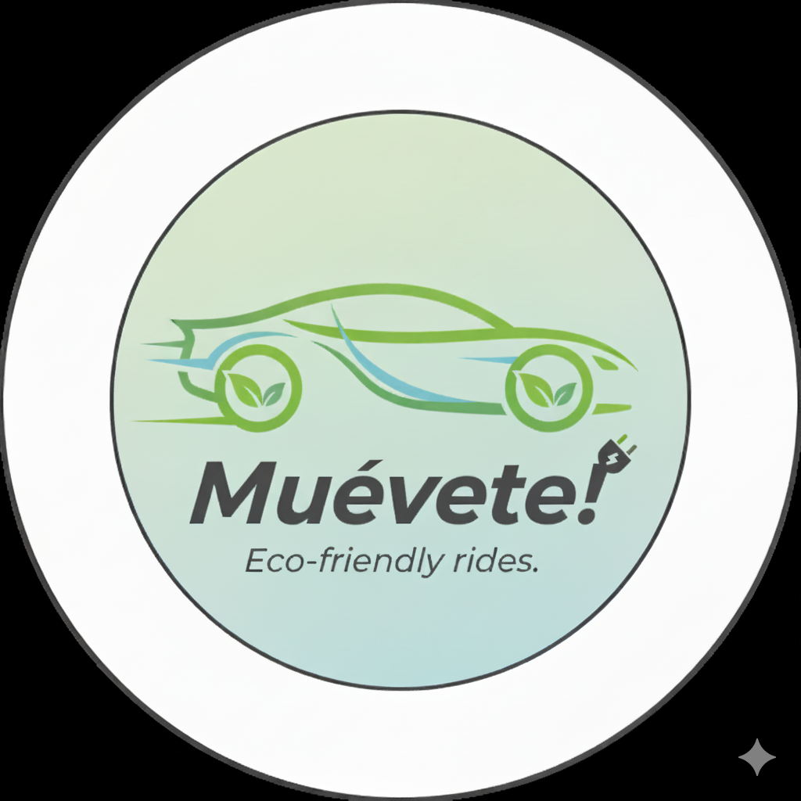
        </div>
    <td colspan="1" valign="top" style="font-weight: bold;">
    Tembici
    <div style="text-align: center; margin-top: 20px;">
                
        </div>
    </td>
    <td colspan="1" valign="top" style="font-weight: bold;">
      Airbnb
      <div style="text-align: center; margin-top: 40px;">
                
            </div>
      </td>
    <td colspan="1" valign="top" style="font-weight: bold;" >
      CityBikeLima
      <div style="text-align: center; margin-top: 20px;">
                
            </div>
    </td>
  </tr>
  <tr>
    <td colspan="1" rowspan="2"><p>Perfil</p></td>
    <td colspan="2">Overview</td>
    <td colspan="1" valign="top">Es una aplicación web que conecta a personas interesadas en usar estos medios de transporte con aquellos que los poseen, 
simplificando el proceso de renta o compra y fomentando una comunidad más consciente del medio ambiente en Perú.</td>
    <td colspan="1" valign="top">Es una empresa líder en soluciones de movilidad urbana en América Latina, conocida principalmente por sus sistemas de bicicletas compartidas. 
Fundada en 2010 en Brasil, Tembici ha expandido sus operaciones a varias ciudades en Brasil, Argentina, y Chile, promoviendo un estilo de vida más saludable y sostenible.</td>
    <td colspan="1" valign="top">Es una plataforma de alojamiento en línea que permite a los usuarios alquilar o reservar alojamientos únicos en todo el mundo, desde habitaciones privadas y apartamentos hasta casas completas y propiedades únicas como castillos o casas en árboles.</td>
    <td colspan="1" valign="top">Es un sistema de bicicletas compartidas en Lima, Perú, diseñado para ofrecer una alternativa de transporte urbano sostenible y eficiente. 
El servicio está enfocado en facilitar el desplazamiento en la ciudad, especialmente en áreas con alta congestión vehicular.</td>
  </tr>
  <tr>
    <td colspan="2">Ventaja competitiva</td>
    <td colspan="1" valign="top">Facilita la movilidad urbana al conectar a universitarios con vehículos, ofreciendo características clave como valoraciones y reseñas, filtros avanzados, historial de alquileres y compras, y un mapa interactivo.
Fomenta la participación mediante la implementación de elementos de gamificación.</td>
    <td colspan="1" valign="top">Las estaciones de Tembici están ubicadas en puntos clave de las ciudades, como estaciones de metro, áreas comerciales y zonas residenciales.
El servicio está disponible las 24 horas del día, los 7 días de la semana.</td>
    <td colspan="1" valign="top">Incluyen actividades y eventos organizados por locales, como tours, clases de cocina, y aventuras al aire libre.</td>
    <td colspan="1" valign="top"> Ofrece una variedad de planes de suscripción que permiten a los usuarios elegir entre opciones diarias, semanales y mensuales, adaptándose a diferentes necesidades y presupuestos.
Los costos de alquiler suelen ser accesibles en comparación con otros medios de transporte, haciendo que el uso de bicicletas compartidas sea una opción económica.</td>
  </tr>
  <tr>
    <td colspan="1" rowspan="2"><p>Perfil de Marketing</p></td>
    <td colspan="2">Mercado objetivo</td>
    <td colspan="1" valign="top">Universitarios y adquirientes.</td>
    <td colspan="1" valign="top">Usuarios urbanos, turistas, entusiastas de la movilidad sostenible, empresas, gobiernos locales, y comunidades residenciales.</td>
    <td colspan="1" valign="top">Viajeros y turistas, profesionales de negocios, anfitriones de propiedades y experiencias, familias y grupos.</td>
    <td colspan="1" valign="top">Usuarios urbanos, turistas, defensores de la movilidad sostenible, familias, y colaboradores municipales.</td>
  </tr>
  <tr>
    <td colspan="2">Estrategias de marketing</td>
    <td colspan="1" valign="top">Ofrecer una prueba gratuita durante el primer mes a los usuarios.</td>
    <td colspan="1" valign="top"> Promociones y descuentos especiales.
Campañas en redes sociales y medios digitales.</td>
    <td colspan="1" valign="top">Publicidad digital y en redes sociales.</td>
    <td colspan="1" valign="top">Colaboraciones con universidades y empresas.
Eventos locales para promover el uso de bicicletas.</td>
  </tr>
  <tr>
    <td colspan="1" rowspan="3"><p>Perfil de Producto</p></td>
    <td colspan="2">Productos & Servicios</td>
    <td colspan="1" valign="top">Aplicación web que conecta a usuarios interesados en rentar o comprar bicicletas, scooters, skateboards, motos eléctricas, y otros vehículos con aquellos que tienen estos vehículos disponibles.</td>
    <td colspan="1" valign="top">Alquiler de bicicletas mediante una aplicación móvil, facilitando la movilidad urbana sostenible y flexible para los usuarios.</td>
    <td colspan="1" valign="top">Plataforma en línea que ofrece una amplia gama de opciones de alojamiento, desde habitaciones privadas hasta casas completas, en todo el mundo.</td>
    <td colspan="1" valign="top">Proporcionar movilidad urbana sostenible y accesible a través de una aplicación móvil que permite el alquiler y gestión de las bicicletas.</td>
  </tr>
  <tr>
    <td colspan="2">Precios & Costos</td>
    <td colspan="1" valign="top">• Plan Cachimbo: Ofrece hasta 2 publicaciones al mes para rentar o vender vehículos, con soporte básico. El costo es de $1.99 al mes después del período de prueba.

• Plan Universitario: Permite hasta 10 publicaciones al mes, con la opción de destacar tus publicaciones y soporte prioritario. El costo es de $5.99 al mes después del período de prueba.

• Plan Graduado: Proporciona publicaciones ilimitadas para rentar o vender vehículos, con soporte 24/7. El costo es de $19.99 al mes después del período de prueba.</td>
    <td colspan="1" valign="top">• Plan Diario: Aproximadamente $0.50 a $1.00 por hora, con un costo máximo diario que varía entre $5.00 y $10.00.

• Plan Mensual: Cuesta entre $25.00 y $40.00.

• Plan Anual: Está en el rango de $150.00 a $300.00.</td>
    <td colspan="1" valign="top">• Alojamientos por Noche: Los precios pueden variar desde alrededor de $30 a $200 o más por noche, dependiendo de la ciudad, el tipo de propiedad y la temporada.

• Estancias Largas: Muchos anfitriones ofrecen descuentos para estancias de una semana o más, que pueden reducir el costo por noche.

• Experiencias: Los precios para experiencias (actividades o tours ofrecidos por locales) generalmente oscilan entre $20 y $100 por persona, aunque pueden variar ampliamente.</td>
    <td colspan="1" valign="top">• Plan Diario: Aproximadamente S/ 8.00 a S/ 15.00 por día.

• Plan Mensual: Alrededor de S/ 50.00 a S/ 100.00.

• Plan Anual: S/ 300.00 a S/ 600.00, dependiendo de la suscripción y beneficios adicionales.</td>
  </tr>
  <tr>
    <td colspan="2">Canales de distribución (Web y/o Móvil)</td>
    <td colspan="1" valign="top">El servicio estará disponible temporalmente a través de la aplicación.</td>
    <td colspan="1" valign="top">App móvil, el sitio web, estaciones físicas, alianzas con empresas y universidades, y redes sociales.</td>
    <td colspan="1" valign="top">Sitio web, la app móvil, colaboraciones con agencias de viajes y plataformas de terceros, y redes sociales.</td>
    <td colspan="1" valign="top">App móvil, el sitio web, estaciones físicas y redes sociales.</td>
  </tr>
  <tr>
    <td colspan="1" rowspan="5"><p>Análisis SWOT</p></td>
    <td colspan="6">Realice esto para su startup y sus competidores. Sus fortalezas deberían apoyar sus oportunidades y contribuir a lo que ustedes definen como su posible ventaja competitiva.</td>
  </tr>
  <tr>
    <td colspan="2">Fortalezas</td>
    <td colspan="1" valign="top">Facilita una comunicación flexible entre el universitario y el adquiriente a través del foro de contacto.</td>
    <td colspan="1" valign="top">Red de bicicletas amplia y bien establecida y tecnología avanzada en la app.</td>
    <td colspan="1" valign="top">Amplia variedad de opciones de alojamiento y plataforma global con presencia en numerosos países.</td>
    <td colspan="1" valign="top">Red de estaciones bien distribuida y sistema de bicicletas moderno y eficiente.</td>
  </tr>
  <tr>
    <td colspan="2">Debilidades</td>
    <td colspan="1" valign="top">Baja visibilidad y promoción.</td>
    <td colspan="1" valign="top">Cobertura limitada en algunas áreas, mantenimiento y disponibilidad de bicicletas.</td>
    <td colspan="1" valign="top">Problemas de seguridad y confianza, inconsistencias en la calidad de las propiedades, falta de regulación y cumplimiento normativo, dificultades en la gestión de disputas, y dependencia de la satisfacción del anfitrión para la experiencia del huésped.</td>
    <td colspan="1" valign="top">Infraestructura insuficiente, mantenimiento irregular de bicicletas, problemas con la tecnología de la app, escasa presencia en medios y redes, limitaciones en la expansión y baja fidelización de usuarios</td>
  </tr>
  <tr>
    <td colspan="2">Oportunidades</td>
    <td colspan="1" valign="top">Optimización de las áreas deficientes en las ofertas de nuestros competidores en el mercado y aprovechamiento de la gran demanda entre los universitarios peruanos que poseen vehículos menores no utilizados.</td>
    <td colspan="1" valign="top">Expansión a nuevas áreas, alianzas con universidades y empresas, mejora de infraestructura, innovaciones en la app, campañas de concientización e integración con otros transportes.</td>
    <td colspan="1" valign="top">Expansión a nuevos destinos, ofertas para grupos, mejoras en la experiencia del huésped, colaboraciones con empresas locales, herramientas para anfitriones y aumento de seguridad mediante tecnología avanzada.</td>
    <td colspan="1" valign="top">Expansión a más áreas de la ciudad, asociaciones con universidades y empresas, mejora de la infraestructura de estaciones, actualización tecnológica de la app, campañas de promoción y integración con otros medios de transporte.</td>
  </tr>
  <tr>
    <td colspan="2">Amenazas</td>
    <td colspan="1" valign="top">Inflación y volatilidad económica.</td>
    <td colspan="1" valign="top">Problemas de seguridad, condiciones climáticas adversas, falta de infraestructura adecuada.</td>
    <td colspan="1" valign="top">Cambios en regulaciones locales, competencia de otras plataformas de hospedaje.</td>
    <td colspan="1" valign="top">Robo o vandalismo de bicicletas.</td>
  </tr>
</table>

### 2.1.2. Estrategias y tácticas frente a competidores

Basado en el análisis competitivo previo, se identificaron claramente las fortalezas, oportunidades, debilidades y amenazas de los competidores. Esta información es fundamental para diseñar estrategias y tácticas que permitan superar a la competencia cuando el servicio se lance al mercado de manera rentable. A continuación, se presentan una serie de estrategias y tácticas planificadas para lograr este objetivo.

- **Afrontando las fortalezas de nuestros competidores:**
    - Lanzar nuevas funcionalidades tecnológicas para destacar en el mercado.
    - Ofrecer soporte 24/7 personalizado y proactivo.

  **Nuestras fortalezas son:**
    - Desarrollo de nuevas características tecnológicas.
    - Diferenciación en mercados poco atendidos.

  **Estrategias:**
    - Nos enfocaremos en universitarios, ofreciendo opciones de renta o compra a largo plazo para aquellos que necesiten vehículos menores para desplazarse diariamente.

  **Tácticas:**
    - Organizaremos eventos de lanzamiento en universidades o zonas clave.

---

- **Afrontando las oportunidades de nuestros competidores:**
    - Implementaremos rápidamente nuevas funciones y mejoras.
    - Ofreceremos un foro de contacto excepcional.

  **Nuestras debilidades son:**
    - No tenemos la misma presencia que competidores establecidos, lo que puede dificultar la captación de usuarios.
    - Recursos más limitados para marketing y tecnología.

  **Estrategias:**
    - Promoveremos Muevete! como una alternativa ecológica y sostenible.
    - Implementaremos programas de reforestación o reducción de carbono por cada alquiler o compra.
    - Resaltaremos el uso de vehículos eléctricos y de bajo impacto ambiental.

  **Tácticas:**
    - Identificaremos áreas de alto tránsito estudiantil con baja competencia.
    - Estableceremos operaciones en esas zonas antes que los competidores para capturar mercado local.

---

- **Afrontando nuevamente las oportunidades de nuestros competidores:**
    - Resaltaremos nuestro enfoque en la sostenibilidad.
    - Nos enfocaremos en áreas con poca competencia y alta demanda.

  **Nuestras debilidades son:**
    - Menor reconocimiento de marca.
    - Presupuesto más ajustado.
    - Presencia inicial limitada.

  **Estrategias:**
    - Ofreceremos tarifas con un mes gratuito para los universitarios, construyendo una base de usuarios estable y recurrente.

  **Tácticas:**
    - Ofreceremos un foro de contacto durante horas pico (mañanas antes de clases), distinguiéndonos de competidores con soporte limitado.

---

- **Afrontando las oportunidades de nuestros competidores:**
    - Implementaremos filtros para resaltar la calidad del cliente.

  **Nuestras debilidades son:**
    - Reconocimiento de marca limitado.
    - Presupuesto reducido para marketing y operaciones.
    - Presencia aún en expansión.


## 2.2. Entrevistas

### 2.2.1. Diseño de entrevistas

En esta sección se han definido todas las preguntas que se plantearán en el momento de realizar las entrevistas a los diferentes segmentos objetivos.

#### Preguntas dirigidas a Universitarios

##### Preguntas principales
1. ¿Podrías decirme tu nombre completo y edad?
2. ¿En qué distrito resides actualmente?
3. ¿Cuál es tu estado civil?
4. ¿Dónde naciste?
5. ¿Qué dispositivos tecnológicos utilizas?
6. ¿Qué navegadores utilizas?
7. ¿Qué tipo de vehículo(s) menor(es) posees?
8. ¿Qué habilidades consideras que tienes en relación con el manejo o mantenimiento de tu(s) vehículo(s)?
9. ¿Qué factores consideras al elegir un vehículo menor? (Ej. economía, estilo, funcionalidad)
10. ¿Qué influencias (familia, amigos, medios, etc.) han afectado tus decisiones al comprar un vehículo?
11. ¿Qué tipos de vehículos tienes disponibles para rentar o vender?
12. ¿Cómo determinas el precio de tus vehículos?
13. ¿Qué medidas de seguridad implementas para asegurarte de que tus vehículos estén en buen estado antes de rentarlos o venderlos?
14. ¿Cómo manejas la limpieza y desinfección de los vehículos?
15. ¿Cuáles son los requisitos o condiciones para rentar o vender uno de tus vehículos?

##### Preguntas complementarias
16. ¿Sigues algún protocolo específico para la limpieza y desinfección, y con qué frecuencia realizas estas tareas?
17. ¿Qué proceso sigues para verificar la identidad y credibilidad de los posibles adquirientes?
18. ¿Cómo organizas la entrega y recogida de los vehículos? ¿Tienes puntos de recogida específicos o cómo coordinas estos procesos?
19. ¿Cómo manejas las valoraciones y reseñas que dejan los adquirientes?
20. Durante el periodo de renta o venta, ¿qué tipo de soporte proporcionas a los adquirientes?
21. ¿Estás abierto a considerar descuentos o promociones especiales para atraer más adquirientes?
22. ¿Hay alguna mejora o característica que te gustaría ver en la aplicación que utilizas para gestionar tus vehículos?

---

#### Preguntas dirigidas a Adquirientes

##### Preguntas principales
1. ¿Podrías decirme tu nombre completo y edad?
2. ¿En qué distrito resides actualmente?
3. ¿Dónde naciste y en qué lugar vives actualmente?
4. ¿Cuál es tu estado civil?
5. ¿Podrías describir tu nivel socioeconómico? ¿Te consideras en un nivel alto, intermedio o bajo?
6. ¿Podrías contarnos un poco acerca de ti y tu experiencia con el alquiler y la compra de vehículos?
7. ¿Qué te impulsó a buscar una aplicación para alquilar o comprar vehículos?
8. ¿Qué esperas lograr al utilizar una aplicación para alquilar o comprar vehículos?
9. ¿Qué dificultades o problemas has enfrentado en tus experiencias previas con el alquiler y la compra de vehículos?
10. ¿Qué características consideras esenciales en una aplicación para alquilar o comprar vehículos?
11. ¿Qué métodos de pago prefieres para realizar transacciones en línea?
12. ¿Cómo te gustaría recibir notificaciones sobre tus reservas y el estado de los vehículos?
13. ¿Cuál ha sido tu experiencia con la seguridad y protección en el alquiler y la compra de vehículos?
14. ¿Qué mejoras o características adicionales crees que podrían mejorar tu experiencia al usar una aplicación de renta o compra de vehículos?

##### Preguntas complementarias
15. ¿Cómo has gestionado el alquiler o la compra de vehículos en el pasado?
16. ¿Qué tipo de soporte o asistencia esperas recibir durante el proceso de alquiler o compra?
17. ¿Tienes alguna preferencia particular en cuanto a la aplicación o tecnología que se utiliza para acceder a la aplicación?
18. ¿Cómo prefieres gestionar la búsqueda de vehículos en una aplicación?
19. ¿Qué tipo de información te gustaría ver en las descripciones de los vehículos?

### 2.2.2 Registro de entrevistas

**Entrevista a Universitarios.**

|                               **Entrevista 1**                               |                                                                                                                                                                                        **Brissa**                                                                                                                                                                                        | 
|:----------------------------------------------------------------------------:|:--------------------------------------------------------------------------------------------------------------------------------------------------------------------------------------------------------------------------------------------------------------------------------------------------------------------------------------------------------------------------------------:|
|                            <center>Edad</center>                             |                                                                                                                                                                                  <center>19</center>                                                                                                                                                                                  |
|                          <center>Distrito</center>                           |                                                                                                                                                                                <center>Rímac</center>                                                                                                                                                                                |
|   <center></center>    |                                                                                                                                                                              <center>Brissa valora EcoTech porque le ofrece una solución para utilizar un vehículo menor que no usa. Le interesa nuestra metodología para facilitar el alquiler y la venta de estos vehículos, así como el registro de los mismos. Aprecia la simplicidad con la que una persona puede ofrecer servicios de alquiler y venta a través de nuestra aplicación. Sin embargo, sugiere que deberíamos mejorar las interacciones entre quienes alquilan y quienes ofrecen la renta o compra.</center>                                                                                                                                                                              |
|                    <center>Timing: 14:53-20:01 </center>                     |                                                                                                                                                                              <center>URL: [[link](https://acortar.link/uMdFvk)](https://upcedupe-my.sharepoint.com/:v:/g/personal/u202213222_upc_edu_pe/EYvfM5T1ScdBpoM4ZDAvlQgBLmbxD7DTIk_2O02DixCJBw?e=vsHMUY&nav=eyJyZWZlcnJhbEluZm8iOnsicmVmZXJyYWxBcHAiOiJTdHJlYW1XZWJBcHAiLCJyZWZlcnJhbFZpZXciOiJTaGFyZURpYWxvZy1MaW5rIiwicmVmZXJyYWxBcHBQbGF0Zm9ybSI6IldlYiIsInJlZmVycmFsTW9kZSI6InZpZXcifX0%3D) </center>                                                                                                          
|                               **Entrevista 2**                                |                                                                                                                                                                                                                                    **Name**                                                                                                                                                                                                                                    | 
|                             <center>Edad</center>                             |                                                                                                                                                                                                                              <center>Age</center>                                                                                                                                                                                                                              |
|                           <center>Distrito</center>                           |                                                                                                                                                                                                                           <center>District</center>                                                                                                                                                                                                                            | 
| <center></center> |                                                                                                                                                                                                                         <center> Descripcion </center>                                                                                                                                                                                                                         | 
|                     <center>Timing: 4:58-10:04 </center>                      |                                                                                                                                                                                                                          <center>URL: link </center>                                                                                                                                                                                                                           | 
|                               **Entrevista 3**                                |                                                                                                                                                                                                                        **Yeni Fiorella Alvarado Mejia**                                                                                                                                                                                                                        | 
|                             <center>Edad</center>                             |                                                                                                                                                                                                                            <center>28 años</center>                                                                                                                                                                                                                            |
|                           <center>Distrito</center>                           |                                                                                                                                                                                                                          <center>Los Olivos</center>                                                                                                                                                                                                                           | 
|  <center></center>  | <center>Yeni valora una aplicación como la nuestra porque le ofrece una solución para utilizar un vehículo menor que no usa. Le interesa nuestra metodología para facilitar el alquiler y la venta de estos vehículos, así como el registro de los mismos. Aprecia la simplicidad con la que una persona puede ofrecer servicios de alquiler y venta a través de nuestra aplicación. Le gustaria que aseguramos el alquiler de sus vehículos y la seguridad de estos.</center> | 
|                        <center>Timing: 6:27 </center>                         |                                                                                                                                                                                                               <center>URL: https://upcedupe-my.sharepoint.com/:v:/g/personal/u20211a789_upc_edu_pe/EX3B1v6zImNLiJ-V8VgFw10Bc3l7-t9b43j0KdGtmeYJ_A?nav=eyJyZWZlcnJhbEluZm8iOnsicmVmZXJyYWxBcHAiOiJTdHJlYW1XZWJBcHAiLCJyZWZlcnJhbFZpZXciOiJTaGFyZURpYWxvZy1MaW5rIiwicmVmZXJyYWxBcHBQbGF0Zm9ybSI6IldlYiIsInJlZmVycmFsTW9kZSI6InZpZXcifX0%3D&e=q3V2Ld </center>                                                                                                                                                                                                               | 

**Entrevista a Adquirientes.**

|                               **Entrevista 1**                               |                                                                                                                                                                                        **Silvia Alexandra Flores Garcia**                                                                                                                                                                                        | 
|:----------------------------------------------------------------------------:|:--------------------------------------------------------------------------------------------------------------------------------------------------------------------------------------------------------------------------------------------------------------------------------------------------------------------------------------------------------------------------------------:|
|                            <center>Edad</center>                             |                                                                                                                                                                                  <center>19</center>                                                                                                                                                                                  |
|                          <center>Distrito</center>                           |                                                                                                                                                                                <center>San Martín</center>                                                                                                                                                                                |
|   <center></center>    |                                                                                                                                                                              <center>Silvia, una estudiante de veterinaria a la que entrevistamos para obtener información valiosa para nuestro proyecto, expresó que la idea de alquilar y vender vehículos menores a través de una aplicación es innovadora, especialmente por su enfoque en opciones que benefician al medio ambiente. Destacó la conveniencia de los métodos de pago por su rapidez y eficiencia. Finalmente, mencionó que le gustaría poder comunicarse directamente con el universitario para discutir detalles de la renta y compra, conocer el estado del vehículo y dejar una valoración.</center>                                                                                                                                                                              |
|                    <center>Timing: 5:26 </center>                     |                                                                                                                                                                              <center>URL: [link](https://upcedupe-my.sharepoint.com/:v:/g/personal/u202213222_upc_edu_pe/EW5xM21GEKZDlK5WuFuOBhcB_IJpaBiFkexh2W4ghfdgOg?e=c55P3H&nav=eyJyZWZlcnJhbEluZm8iOnsicmVmZXJyYWxBcHAiOiJTdHJlYW1XZWJBcHAiLCJyZWZlcnJhbFZpZXciOiJTaGFyZURpYWxvZy1MaW5rIiwicmVmZXJyYWxBcHBQbGF0Zm9ybSI6IldlYiIsInJlZmVycmFsTW9kZSI6InZpZXcifX0%3D) </center>                                                                                                                                                                               |
|                               **Entrevista 2**                               |                                                                                                                                                                                        **Name**                                                                                                                                                                                        | 
|                            <center>Edad</center>                             |                                                                                                                                                                                  <center>Age</center>                                                                                                                                                                                  |
|                          <center>Distrito</center>                           |                                                                                                                                                                               <center>District</center>                                                                                                                                                                                |
|  <center></center>   |                                                                                                                                                                              <center>Descripcion</center>                                                                                                                                                                              |
|                    <center>Timing: 20:02-25:01 </center>                     |                                                                                                                                                                              <center>URL: link </center>                                                                                                                                                                               |
|                               **Entrevista 3**                               |                                                                                                                                                                            **Hilder Francisco Ruiz Perez**                                                                                                                                                                             | 
|                            <center>Edad</center>                             |                                                                                                                                                                                <center>22 Años</center>                                                                                                                                                                                |
|                          <center>Distrito</center>                           |                                                                                                                                                                        <center>San Juan de Lurigancho</center>                                                                                                                                                                         |
| <center></center> | <center>Francisco, le gusta el propósito de la aplicación, puesto que ya usó algunas anteriormente por salidas familiares. Espera que con esta aplicación se pueda ahorrar tiempo, dinero y que sea más seguro. Sugiere que se podría mejorar teniendo fotos de los vehículos y distintas características del vehículo, sin olvidar tener un comprobante de pago como prueba.</center> |
|                        <center>Timing: 7:59 </center>                        |                                                                                                                                                                   <center>URL: https://upcedupe-my.sharepoint.com/:v:/g/personal/u20211a789_upc_edu_pe/EWxE05DPOI5NnTme01aBA-kB20xF3TelWnk8DFQ1sV9etg?nav=eyJyZWZlcnJhbEluZm8iOnsicmVmZXJyYWxBcHAiOiJTdHJlYW1XZWJBcHAiLCJyZWZlcnJhbFZpZXciOiJTaGFyZURpYWxvZy1MaW5rIiwicmVmZXJyYWxBcHBQbGF0Zm9ybSI6IldlYiIsInJlZmVycmFsTW9kZSI6InZpZXcifX0%3D&e=MfQe3k </center>                                                                                                                                                                   |

### 2.2.3 Análisis de entrevistas.
**Análisis del segmento universitario**

Los entrevistados valoran altamente la aplicación Muevete! por su capacidad para facilitar la renta y la venta de vehículos menores inactivos, permitiéndoles generar ingresos adicionales y contribuir a la movilidad sostenible. El 100% de los usuarios aprecian cómo la aplicación optimiza el proceso de rentar o vender estos vehículos, destacando su utilidad para maximizar el valor de los recursos no utilizados. La facilidad de uso y la funcionalidad para registrar y gestionar los vehículos son aspectos especialmente valorados.

Sin embargo, se identificaron áreas de mejora. Un 67% de los usuarios, como Rodrigo, sugiere incorporar promociones u ofertas para atraer a más adquirientes y mejorar la visibilidad del vehículo. Además, un 33% menciona la necesidad de optimizar la comunicación entre universitario y adquiriente, como se indicó en la tercera entrevista, para hacer el proceso de alquiler y venta más eficiente. También se destacó la importancia de incluir herramientas que permitan una gestión más eficiente de las reservas y el seguimiento de alquileres y ventas. En general, aunque EcoMovil es percibida como una herramienta beneficiosa, mejorar la interacción, las ofertas y las herramientas de gestión podría potenciar aún más la experiencia del usuario.

**Análisis del segmento de adquiriente**

El 100% de los entrevistados valoran la presencia de un mapa interactivo y las opciones de edición de vehículos. Un 67% prefiere usar el servicio para disfrutar del paisaje y recorrer distancias medias, indicando una inclinación hacia experiencias agradables y prácticas de movilidad urbana. No obstante, un 33% ha tenido experiencias desfavorables debido a cobros imprevistos, subrayando la importancia de mantener la claridad en los precios y evitar cargos inesperados.

Además, el 67% valora positivamente la atención al cliente y la posibilidad de comunicarse directamente con el universitario, sugiriendo que una comunicación efectiva es esencial para una experiencia de alquiler y compra satisfactoria. Todos los entrevistados consideran importantes las ventajas ambientales del servicio, lo que refleja una alta conciencia y aprecio por el impacto positivo en el medio ambiente.

Algunos usuarios también sugirieron incluir características adicionales, como opciones de seguro más flexibles y mejoras en el proceso de devolución del vehículo, para aumentar la satisfacción general y la confianza en el servicio.


## 2.3. Needfinding

### 2.3.1. User Personas

- Segmento Universitarios:


- Segmento Adquirientes:


---

### 2.3.2. User Task Matrix

Se presenta el Task Matrix, una tabla que muestra las tareas realizadas por los User Personas, incluyendo su importancia y frecuencia. A continuación, se proporciona un resumen basado en la información presentada.

<table>
    <tr>
        <td></td>
        <td colspan=2>
            <b>Universitarios</b>
        </td>
        <td colspan=2>
            <b>Adquirientes</b>
        </td>
    </tr>
    <tr>
        <td>
            <b>Task</b>
        </td>
        <td>
            <b>Frequency</b>
        </td>
        <td>
            <b>Importance</b>
        </td>
        <td>
        <b>Frequency</b>
        </td>
        <td>
        <b>Importance</b>
        </td>
    </tr>
    <tr>
        <td>
            Montar bicicleta
        </td>
        <td>
        Rarely
        </td>
        <td>
            High
        </td>
        <td>
        Sometimes
        </td>
        <td>
        Medium
        </td>
    </tr>
    <tr>
        <td>
            Generar ingresos
        </td>
        <td>
            Rarely
        </td>
        <td>
            High
        </td>
        <td>
        Always
        </td>
        <td>
        High
        </td>
    </tr>
    <tr>
        <td>
            Viajar
        </td>
        <td>
            Rarely
        </td>
        <td>
            Low
        </td>
        <td>
        Rarely
        </td>
        <td>
        Medium
        </td>
    </tr>
    <tr>
        <td>
            Comprar y rentar vehículos
        </td>
        <td>
            Never
        </td>
        <td>
        Low
        </td>
        <td>
            Rarely
        </td>
        <td>
        Medium
        </td>
    </tr>
    <tr>
        <td>
            Explorar nuevos lugares
        </td>
        <td>
            Rarely
        </td>
        <td>
            Low
        </td>
        <td>
            Sometimes
        </td>
        <td>
        Medium
        </td>
    </tr>
    <tr>
        <td>
            Conocer gente
        </td>
        <td>
            Sometimes
        </td>
        <td>
            Medium
        </td>
        <td>
            Sometimes
        </td>
        <td>
        High
        </td>
    </tr>
    <tr>
        <td>
            Gestionamiento de huella de carbono
        </td>
        <td>
            Never
        </td>
        <td>
            Low
        </td>
        <td>
            Always
        </td>
        <td>
        High
        </td>
    </tr>
    <tr>
        <td>
            Informarse a través del foro de contacto
        </td>
        <td>
            Sometimes
        </td>
        <td>
            Medium
        </td>
        <td>
            Sometimes
        </td>
        <td>
        High
        </td>
    </tr>
    <tr>
        <td>
            Buscar descuentos
        </td>
        <td>
            Sometimes
        </td>
        <td>
            Medium
        </td>
        <td>
            Sometimes
        </td>
        <td>
        High
        </td>
    </tr>
    <tr>
        <td>
            Compartir su experiencia por redes sociales
        </td>
        <td>
            Sometimes
        </td>
        <td>
            Low
        </td>
        <td>
            Always
        </td>
        <td>
        High
        </td>
    </tr>
    <tr>
        <td>
            Contactar a través de WhatsApp
        </td>
        <td>
            Sometimes
        </td>
        <td>
            High
        </td>
        <td>
            Rarely
        </td>
        <td>
        Medium
        </td>
    </tr>
    <tr>
        <td>
            Renovar la suscripción
        </td>
        <td>
            Sometimes
        </td>
        <td>
            Medium
        </td>
        <td>
            Sometimes
        </td>
        <td>
        Medium
        </td>
    </tr>
</table>

En este caso, observamos que para Camila, las tareas relacionadas con la gestión de la huella de carbono son de alta prioridad e importancia, reflejando su fuerte preocupación por el medio ambiente. Camila también se enfoca en explorar nuevos lugares y compartir sus experiencias con amigos y en redes sociales.

Por otro lado, para Alex Hidalgo, la tarea principal está orientada hacia la generación de ingresos, motivado por su necesidad de comprar artículos personales y apoyar a su familia. Alex se centra principalmente en cumplir con sus responsabilidades académicas.

A pesar de sus diferencias, ambos comparten una valoración común en la importancia de la seguridad frente a posibles incidentes.

### 2.3.3. User Journey Mapping

En esta sección se ilustra el recorrido completo del usuario (end-to-end journey) de la aplicación Muevete! para los segmentos objetivos: Universitarios y adquirientes. El User Journey Mapping comienza desde el momento en que el cliente toma conocimiento de la aplicación, pasando por el proceso de decidir usarla, registrarse, utilizarla y, finalmente, la posibilidad de dejar de usarla.

- Segmento Universitarios:


- Segmento Adquirientes:


---

### 2.3.4. Empathy Mapping

- Segmento Universitarios:


- Segmento Adquirientes:


---

### 2.3.5. As-is Scenario Mapping

- Segmento Universitarios:


- Segmento Adquirientes:


---

## 2.4. Ubiquitous Language

- **Vehicle (Vehículo)**: Entidad central en la plataforma que representa cualquier medio de transporte ecológico disponible para alquiler o compra, como bicicletas, scooters, skateboards, o motos eléctricas.
- **University Student (Universitario)**: Persona que posee un vehículo y lo publica en la plataforma con el objetivo de generar ingresos al rentarlo o venderlo.
- **Acquirer (Adquiriente)**: Usuario que busca alquilar o comprar un vehículo para su transporte personal o recreativo, ya sea a corto o largo plazo.
- **Renting (Alquiler)**: Proceso mediante el cual un Universitario otorga el uso temporal de su vehículo a un Adquiriente a cambio de un pago.
- **Vehicle Listing (Publicación de Vehículo)**: Acción realizada por el Universitario para colocar su vehículo en la plataforma, especificando detalles relevantes como precio, disponibilidad y condiciones de uso.
- **Vehicle Sale (Venta de Vehículo)**: Proceso en el cual un Universitario ofrece un vehículo para su venta definitiva a un Adquiriente.
- **Transaction (Transacción)**: Proceso financiero que ocurre al completar una acción de alquiler o venta, involucrando el pago y la entrega del vehículo.
- **Transaction History (Historial de Transacciones)**: Registro de todas las acciones de alquiler o venta realizadas por un Universitario o Adquiriente en la plataforma.
- **WhatsApp Coordination (Coordinación por WhatsApp)**: Comunicación directa entre un Universitario y un Adquiriente para acordar detalles logísticos como la entrega o recolección del vehículo.
- **Forum (Foro)**: Espacio colaborativo donde los usuarios pueden publicar preguntas, compartir experiencias y resolver dudas relacionadas con vehículos, alquileres, ventas o la plataforma en general.
- **Review and Rating (Calificación y Reseña)**: Sistema donde los Adquirientes pueden calificar su experiencia con un vehículo o Universitario, aportando información relevante para otros usuarios.
- **Temporary Insurance (Seguro Temporal)**: Servicio adicional opcional que brinda cobertura contra accidentes o daños durante el alquiler de un vehículo.
- **Subscription Plan (Plan de Suscripción)**: Niveles de membresía que los Universitarios pueden adquirir para acceder a funcionalidades y beneficios específicos de la plataforma.
- **Flexible Income (Ingreso Flexible)**: Beneficio monetario obtenido por los Universitarios mediante la renta o venta de sus vehículos.
- **Marketplace (Mercado)**: Espacio de la plataforma donde los usuarios pueden buscar, alquilar o comprar vehículos disponibles.
- **Pick-up/Drop-off Point (Punto de Entrega y Recolección)**: Ubicación designada donde los Adquirientes pueden recoger o entregar los vehículos alquilados o comprados.
- **Gamification (Gamificación)**: Estrategia que implementa retos, logros y recompensas para motivar a los usuarios a interactuar más activamente en la plataforma.
- **Cachimbo Plan (Plan Cachimbo)**: Plan básico de suscripción para Universitarios, con un límite de publicaciones y soporte limitado.
- **University Plan (Plan Universitario)**: Plan intermedio de suscripción que ofrece más publicaciones mensuales y soporte prioritario.
- **Graduate Plan (Plan Graduado)**: Plan de suscripción avanzado que brinda a los Universitarios publicaciones ilimitadas y soporte completo.
- **Plan Payment (Pago de Plan)**: Evento en el cual un Universitario realiza una transacción para adquirir o renovar un Plan de Suscripción en la plataforma.
- **Reminder Notification (Notificación de Recordatorio)**: Mensaje automático que se envía a los Universitarios y Adquirientes para recordar eventos importantes como la renovación de un plan, la recolección de un vehículo o la finalización de un período de alquiler.
- **Vehicle Verification (Validación de Vehículo)**: Proceso por el cual la plataforma verifica los detalles y la condición de los vehículos publicados por los Universitarios para garantizar la calidad y seguridad del servicio.
- **Achievement (Logro)**: Recompensas o insignias virtuales que los usuarios pueden obtener al cumplir ciertos objetivos, como alcanzar un número específico de alquileres o recibir calificaciones positivas.

---

# Capítulo III: Requirements Specification

## 3.1. To-Be Scenario Mapping

Para elaborar el To-be Scenario Mapping, el equipo definió cómo sería el flujo de trabajo después de la implementación de nuestra solución, EcoMovil, para ambos segmentos objetivos. El propósito de este artefacto es comparar y abordar los aspectos negativos identificados en el As-is Scenario.

- Segmento Universitarios:


- Segmento Adquiriente:


### **3.2. User Stories**

Las historias de usuario son nuestra herramienta para traducir las expectativas y necesidades de las personas en requisitos técnicos claros para el equipo de desarrollo. Una historia bien construida funciona como una brújula, explicando qué se va a construir, para quién y qué valor aporta. Para el proyecto EcoMovil, nuestro equipo ha definido un conjunto de historias que guiarán la creación de nuestra Landing Page, la aplicación web y los componentes técnicos esenciales.

| ID de Historia | Título de la Historia | Narrativa del Usuario | Condiciones para la Aceptación | Épica (ID) |
| :--- | :--- | :--- | :--- | :--- |
| **US01** | Navegación Principal en la Página de Inicio | **Como** visitante de la web (estudiante o usuario), **quiero** una barra de navegación intuitiva **para** poder explorar las diferentes secciones y entender rápidamente lo que EcoMovil ofrece. | **Escenario 1: Visibilidad de la Navegación**<br>**Dado que** un usuario está en la página de inicio,<br>**cuando** la página carga,<br>**entonces** la barra de navegación debe aparecer con todas sus secciones y botones visibles.<br><br>**Escenario 2: Redirección Correcta**<br>**Dado que** un usuario ve la barra de navegación,<br>**cuando** hace clic en cualquier enlace,<br>**entonces** es dirigido correctamente a la sección correspondiente dentro del sitio. | 1 |
| **US02** | Sección de Bienvenida Atractiva | **Como** visitante, **quiero** ver una sección principal (Hero) impactante al entrar a la web **para** captar la esencia de EcoMovil y motivarme a seguir explorando. | **Escenario 1: Carga de la Sección Principal**<br>**Dado que** un usuario llega a la página de inicio,<br>**cuando** la página termina de cargar,<br>**entonces** la sección de bienvenida debe ocupar un lugar protagónico en la parte superior, con un mensaje claro y un diseño atractivo. | 1 |
| **US03** | Pie de Página Informativo | **Como** visitante, **quiero** encontrar un pie de página (Footer) completo **para** consultar información legal y de contacto. | **Escenario 1: Contenido del Pie de Página**<br>**Dado que** un usuario navega por la página,<br>**cuando** llega al final del sitio,<br>**entonces** debe visualizar un pie de página con enlaces a los términos de servicio, políticas de privacidad y otros datos relevantes. | 1 |
| **US04** | Explicación del Funcionamiento | **Como** potencial usuario, **quiero** una sección que explique cómo funciona EcoMovil **para** entender los beneficios de usar la plataforma y cómo puedo sacarle provecho. | **Escenario 1: Claridad de la Sección "Cómo Funciona"**<br>**Dado que** un usuario está en la página de inicio,<br>**cuando** explora el contenido,<br>**entonces** debe encontrar una sección que describa de forma clara y visual el funcionamiento de la aplicación y sus ventajas. | 1 |
| **US05** | Formulario de Contacto Accesible | **Como** interesado en la plataforma, **quiero** tener una sección de contacto fácil de usar **para** poder comunicarme con el equipo y unirme a la comunidad. | **Escenario 1: Disponibilidad de la Sección de Contacto**<br>**Dado que** un usuario está explorando la página,<br>**cuando** busca cómo contactar a EcoMovil,<br>**entonces** debe encontrar una sección visible con la información necesaria para iniciar la comunicación o el registro. | 1 |
| **US06** | Diseño Adaptable a Dispositivos | **Como** usuario, **quiero** que la página de inicio se vea y funcione bien en cualquier dispositivo **para** tener una experiencia consistente desde mi móvil, tablet o computadora. | **Escenario 1: Experiencia en Múltiples Pantallas**<br>**Dado que** un usuario accede a la web desde distintos dispositivos,<br>**cuando** la página carga,<br>**entonces** el contenido debe reorganizarse y ajustarse al tamaño de la pantalla, manteniendo la legibilidad y funcionalidad sin necesidad de hacer zoom. | 1 |
| **US07** | Visualización de Planes y Precios | **Como** universitario, **quiero** ver una sección de planes clara **para** poder comparar las opciones, elegir una y unirme a la plataforma. | **Escenario 1: Presentación de los Planes**<br>**Dado que** un usuario está en la página de inicio,<br>**cuando** navega hacia la sección de planes,<br>**entonces** debe poder ver las distintas opciones, sus características y precios, con un camino claro para seleccionar un plan e iniciar su suscripción. | 1 |
| **US08** | Sección "Sobre Nosotros" | **Como** visitante, **quiero** una sección "Acerca de" **para** conocer la historia, misión y valores del equipo detrás de EcoMovil. | **Escenario 1: Acceso a la Historia de la Marca**<br>**Dado que** un usuario explora la página,<br>**cuando** busca más información sobre la empresa,<br>**entonces** debe encontrar una sección "Acerca de" que narre de forma atractiva la identidad y el propósito de EcoMovil. | 1 |
| **US09** | Opción para Unirse a la Comunidad | **Como** visitante, **quiero** encontrar fácilmente una opción para unirme **para** poder registrar mi correo y ser parte de la comunidad de EcoMovil. | **Escenario 1: Facilidad de Registro**<br>**Dado que** un usuario está interesado en la plataforma,<br>**cuando** decide unirse,<br>**entonces** debe encontrar una sección clara y accesible para iniciar su proceso de registro en EcoMovil. | 1 |
| **US10** | Acceso para Iniciar Sesión | **Como** usuario registrado, **quiero** un acceso visible para iniciar sesión **para** poder ingresar a mi cuenta en la aplicación. | **Escenario 1: Visibilidad del Inicio de Sesión**<br>**Dado que** un usuario visita la página de inicio,<br>**cuando** la página carga,<br>**entonces** la opción para "Iniciar Sesión" o "Ingresar" debe ser fácilmente localizable. | 1 |
| **US11** | Información Específica para Universitarios | **Como** estudiante, **quiero** una sección dirigida a mí **para** entender los beneficios exclusivos y cómo puedo unirme como proveedor de vehículos. | **Escenario 1: Contenido para Estudiantes**<br>**Dado que** un universitario está en la página de inicio,<br>**cuando** explora las opciones,<br>**entonces** debe encontrar una sección con información específica y un llamado a la acción claro para unirse como universitario. | 1 |
| **US12** | Sección de Información Detallada | **Como** visitante curioso, **quiero** una sección de "Conoce Más" **para** profundizar en los detalles y características de la aplicación. | **Escenario 1: Acceso a Detalles Adicionales**<br>**Dado que** un usuario está en la página de inicio,<br>**cuando** busca información más a fondo,<br>**entonces** la sección "Conoce más sobre nosotros" debe ofrecer detalles exhaustivos sobre la plataforma. | 1 |
| **US13** | Botón de Llamada a la Acción Principal | **Como** visitante, **quiero** ver un botón destacado como "Empieza tu viaje" **para** saber exactamente cómo iniciar mi experiencia en EcoMovil. | **Escenario 1: Visibilidad del Botón Principal**<br>**Dado que** un usuario está en la página de inicio,<br>**cuando** la página carga,<br>**entonces** el botón "Empieza tu viaje" debe ser prominente y atractivo, invitando al usuario a dar el siguiente paso. | 1 |
| **US14** | Mención de Derechos Reservados | **Como** usuario, **quiero** ver una nota sobre los derechos reservados **para** sentir confianza en que la plataforma opera de manera profesional y legal. | **Escenario 1: Visualización de la Nota Legal**<br>**Dado que** un usuario navega hasta el final de la página,<br>**cuando** la página carga completamente,<br>**entonces** el texto "Todos los derechos reservados" debe estar visible, confirmando la protección de la propiedad intelectual. | 1 |
| **US15** | Sección Específica para Adquirientes | **Como** persona que busca transporte, **quiero** una sección que me hable directamente **para** entender cómo EcoMovil resuelve mis necesidades de movilidad. | **Escenario 1: Contenido para Adquirientes**<br>**Dado que** un adquiriente potencial está en la página de inicio,<br>**cuando** explora el sitio,<br>**entonces** debe encontrar una sección dedicada que explique los beneficios y el proceso para alquilar o comprar un vehículo. | 1 |
| **US16** | Proceso de Creación de Cuenta | **Como** nuevo universitario, **quiero** un formulario de registro sencillo **para** poder crear mi cuenta y acceder a la aplicación. | **Escenario 1: Registro Exitoso**<br>**Dado que** un usuario está en la página de registro,<br>**cuando** llena los campos requeridos (RUC, email, nombre, contraseña) y pulsa "Registrar",<br>**entonces** su cuenta es creada exitosamente y es redirigido a la página de inicio de la aplicación. | 2 |
| **US17** | Funcionalidad de Inicio de Sesión | **Como** usuario registrado, **quiero** iniciar sesión con mis credenciales **para** acceder a mi perfil y a las funciones de la aplicación. | **Escenario 1: Autenticación Exitosa**<br>**Dado que** un usuario está en la página de login,<br>**cuando** introduce su correo y contraseña correctos y pulsa "Iniciar Sesión",<br>**entonces** el sistema lo valida y le da acceso a la plataforma. | 2 |
| **US18** | Selección de Plan de Suscripción | **Como** universitario, **quiero** poder seleccionar un plan **para** habilitar la opción de publicar mis vehículos en la plataforma. | **Escenario 1: Proceso de Elección de Plan**<br>**Dado que** un usuario está en la sección de planes,<br>**cuando** hace clic en el botón "Elegir Plan" de su opción preferida,<br>**entonces** es dirigido a la pasarela de pago para completar la suscripción y poder publicar sus vehículos. | 3 |
| **US19** | Confirmación de Pago Exitoso | **Como** universitario, **quiero** recibir una confirmación visual de mi pago **para** tener la certeza de que mi suscripción está activa. | **Escenario 1: Mensaje de Confirmación**<br>**Dado que** un usuario ha finalizado el proceso de pago,<br>**cuando** la transacción es aprobada,<br>**entonces** es redirigido a una página que muestra un claro mensaje de "Pago Exitoso". | 3 |
| **US20** | Publicación de Nuevos Vehículos | **Como** universitario, **quiero** un formulario para añadir mis vehículos **para** poder ofrecerlos en alquiler o venta. | **Escenario 1: Añadir un Vehículo**<br>**Dado que** un usuario autenticado está en su panel,<br>**cuando** selecciona "Agregar Vehículo", completa los detalles (tipo, fotos, precio, etc.) y pulsa "Publicar",<br>**entonces** el vehículo se añade a su inventario y recibe una notificación de publicación exitosa. | 4 |
| **US21** | Visualización de Datos de Perfil | **Como** universitario, **quiero** poder ver mi perfil **para** verificar que mis datos personales y de contacto (nombre, email, RUC) son correctos. | **Escenario 1: Acceso al Perfil de Vendedor**<br>**Dado que** un usuario ha iniciado sesión,<br>**cuando** accede a la sección "Mi Perfil",<br>**entonces** la página debe mostrar de forma clara y organizada toda su información registrada. | 5 |
| **US22** | Consulta de Historial de Transacciones | **Como** usuario, **quiero** un historial de vehículos **para** llevar un registro de todas mis transacciones, ya sea como vendedor o como adquiriente. | **Escenario 1: Revisión del Historial**<br>**Dado que** un usuario ha iniciado sesión,<br>**cuando** navega a la sección "Historial de Vehículos",<br>**entonces** el sistema debe mostrar una lista detallada de todos los vehículos alquilados, comprados, rentados o vendidos. | 4 |
| **US23** | Acceso a un Foro de Contacto | **Como** usuario, **quiero** un foro de contacto **para** poder comunicarme con otros propietarios a través de WhatsApp. | **Escenario 1: Interacción en el Foro**<br>**Dado que** un usuario está en la plataforma,<br>**cuando** accede a la sección "Foro",<br>**entonces** debe ver una lista de propietarios y la opción de contactarlos directamente a través de un enlace de WhatsApp. | 6 |
| **US24** | Configuración de Estilos con Tailwind CSS | **Como** desarrollador, **quiero** configurar el archivo `tailwind.config.js` **para** alinear la paleta de colores y tipografías con la identidad visual de EcoMovil. | **Escenario 1: Personalización de la Identidad Visual**<br>**Dado que** tengo acceso al archivo de configuración de Tailwind,<br>**cuando** defino los colores y fuentes de la marca en `tailwind.config.js`,<br>**entonces** todos los componentes de la aplicación deben reflejar consistentemente el estilo de la marca. | 7 |
| **US25** | API para Búsqueda por Geolocalización | **Como** desarrollador, **quiero** implementar una API de búsqueda geolocalizada **para** que los usuarios puedan encontrar vehículos disponibles cerca de ellos en tiempo real. | **Escenario 1: Respuesta de la API Geolocalizada**<br>**Dado que** la infraestructura de la API está configurada,<br>**cuando** la aplicación envía una solicitud con la ubicación del usuario,<br>**entonces** la API debe devolver una lista de vehículos cercanos, incluyendo su distancia y disponibilidad. | 7 |
| **US26** | Búsqueda y Filtro de Vehículos | **Como** usuario, **quiero** poder buscar y filtrar vehículos **para** encontrar rápidamente el que se ajusta a mis necesidades de transporte. | **Escenario 1: Búsqueda por Tipo de Vehículo**<br>**Dado que** estoy en la página de búsqueda,<br>**cuando** ingreso un tipo de vehículo (ej. "bicicleta") y aplico filtros,<br>**entonces** la plataforma me muestra una lista de resultados que coinciden con mi criterio. | 4 |
| **US27** | Creación de Temas de Discusión | **Como** miembro de la comunidad, **quiero** iniciar y participar en discusiones **para** intercambiar información y consejos con otros usuarios. | **Escenario 1: Publicar en el Foro**<br>**Dado que** he iniciado sesión y estoy en el foro,<br>**cuando** creo una nueva discusión con un título y mensaje y la publico,<br>**entonces** mi publicación se hace visible para que otros usuarios puedan leerla y responder. | 6 |
| **US28** | Actualización de la Información de Perfil | **Como** usuario, **quiero** poder editar mi perfil **para** mantener mi información personal siempre actualizada. | **Escenario 1: Edición de Datos Personales**<br>**Dado que** estoy en la página de mi perfil,<br>**cuando** modifico mis datos (nombre, teléfono, etc.) y guardo los cambios,<br>**entonces** el sistema actualiza mi información y me muestra un mensaje de confirmación. | 5 |
| **US29** | Notificaciones de Transacción Exitosa | **Como** usuario, **quiero** recibir una notificación tras un pago exitoso **para** tener la seguridad de que la transacción se completó correctamente. | **Escenario 1: Confirmación de Pago**<br>**Dado que** he realizado un pago en la plataforma,<br>**cuando** el sistema lo procesa exitosamente,<br>**entonces** recibo una notificación instantánea en la app y un correo electrónico con los detalles de la compra o alquiler. | 3 |
| **US30** | Video en la Sección "Sobre el Producto" | **Como** visitante, **quiero** ver un video explicativo **para** entender de forma rápida y visual en qué consiste el producto. | **Escenario 1: Reproducción del Video del Producto**<br>**Dado que** estoy en la página "Acerca del Producto",<br>**cuando** veo la sección de video,<br>**entonces** el video se muestra con controles de reproducción y funciona correctamente al darle play, con una duración máxima de 3 minutos. | 4 |
| **US31** | Video en la Sección "Sobre el Equipo" | **Como** visitante, **quiero** ver un video sobre el equipo **para** conocer a las personas que están detrás de EcoMovil. | **Escenario 1: Reproducción del Video del Equipo**<br>**Dado que** estoy en la página "Acerca del Equipo",<br>**cuando** veo la sección de video,<br>**entonces** el video se muestra con sus controles, se reproduce correctamente y tiene una duración máxima de 3 minutos. | 4 |
| **US32** | Funcionalidad de Múltiples Idiomas | **Como** usuario internacional, **quiero** poder cambiar el idioma de la aplicación **para** utilizarla en mi lengua nativa cómodamente. | **Escenario 1: Cambio de Idioma**<br>**Dado que** estoy usando la aplicación,<br>**cuando** selecciono un nuevo idioma en el menú,<br>**entonces** toda la interfaz de texto se traduce instantáneamente y se actualiza al idioma elegido. | 4 |

## 3.3. Impact Mapping.

En esta sección, presentamos el **Impact Mapping** para el proyecto de **EcoMovil**, cuyo objetivo es desarrollar e implementar un mapa interactivo que facilite la localización. Este mapa es esencial para optimizar la experiencia de nuestros usuarios y alcanzar los objetivos comerciales.

El **Impact Mapping** ofrece una visión clara de cómo los objetivos de negocio, las necesidades de los usuarios y las funcionalidades propuestas se interconectan. Asegura que cada elemento del desarrollo esté alineado con nuestras metas, contribuyendo al éxito de **EcoMovil** y mejorando tanto la experiencia de los universitarios como la de los adquirientes.


### **3.4. Product Backlog**

A continuación, presentamos el Product Backlog de EcoMovil. Esta es la lista priorizada de todas las funcionalidades, mejoras y requisitos técnicos que conforman nuestro proyecto. El orden ha sido definido para asegurar que entreguemos el mayor valor posible a nuestros usuarios en cada etapa del desarrollo.

<br>

| Prioridad | ID de Historia | Elemento del Backlog | Narrativa del Usuario | Puntos de Esfuerzo |
| :--- | :--- | :--- | :--- | :--- |
| 1 | US01 | Navegación Principal de la Página de Inicio | **Como** visitante de la web, **quiero** una barra de navegación clara **para** poder explorar las funcionalidades de la aplicación. | 3 |
| 2 | US02 | Sección de Bienvenida Impactante | **Como** visitante, **quiero** una sección principal atractiva y clara al llegar a la web **para** entender el valor de EcoMovil y motivarme a saber más. | 5 |
| 3 | US03 | Pie de Página Informativo | **Como** visitante, **quiero** un pie de página accesible **para** encontrar rápidamente información adicional como términos y políticas. | 2 |
| 4 | US04 | Explicación del Funcionamiento de EcoMovil | **Como** interesado, **quiero** una sección que explique cómo funciona la plataforma **para** comprender cómo puede mejorar mi experiencia de movilidad ecológica. | 5 |
| 5 | US05 | Sección de Contacto y Registro | **Como** potencial usuario, **quiero** una sección de contacto funcional **para** poder unirme a la comunidad de EcoMovil e iniciar la experiencia. | 3 |
| 6 | US06 | Diseño Web Adaptable (Responsive) | **Como** usuario, **quiero** que la página se adapte a cualquier dispositivo (móvil, tablet, etc.) **para** poder navegarla con facilidad y sin perder legibilidad. | 7 |
| 7 | US07 | Visualización de Planes de Suscripción | **Como** universitario, **quiero** acceder a una sección de planes **para** elegir el que mejor se adapte a mí y unirme a la plataforma. | 5 |
| 8 | US08 | Sección "Sobre Nosotros" | **Como** visitante, **quiero** una sección "Acerca de" **para** conocer la historia, el equipo y la misión que impulsa a EcoMovil. | 4 |
| 9 | US09 | Opción Directa para Unirse | **Como** visitante, **quiero** una sección clara para unirme **para** poder registrar mi correo electrónico fácilmente e inscribirme en la plataforma. | 4 |
| 10 | US10 | Acceso para Iniciar Sesión | **Como** usuario registrado, **quiero** un acceso visible para iniciar sesión **para** poder ingresar a mi cuenta en la aplicación. | 5 |
| 11 | US11 | Contenido Dirigido a Universitarios | **Como** estudiante, **quiero** una sección dedicada a mi perfil **para** entender los beneficios específicos y unirme como proveedor de vehículos. | 4 |
| 12 | US12 | Sección "Conoce Más" | **Como** visitante, **quiero** una sección de "Conoce más sobre nosotros" **para** poder profundizar en los detalles y funcionalidades de EcoMovil. | 4 |
| 13 | US13 | Botón Principal de Llamada a la Acción | **Como** visitante, **quiero** encontrar un botón destacado **para** poder empezar mi viaje en la plataforma de forma intuitiva. | 3 |
| 14 | US14 | Nota sobre Derechos Reservados | **Como** usuario, **quiero** ver una sección de derechos reservados **para** tener la confianza de que la plataforma protege mis derechos y opera legalmente. | 3 |
| 15 | US15 | Contenido Dirigido a Adquirientes | **Como** persona que busca transporte, **quiero** una sección dedicada a mí **para** entender cómo puedo alquilar o comprar vehículos en EcoMovil. | 5 |
| 16 | US16 | API para Búsqueda por Geolocalización | **Como** equipo de desarrollo, **necesitamos** implementar una API de búsqueda geolocalizada **para** ofrecer a los usuarios vehículos disponibles en tiempo real. | 5 |
| 17 | US17 | Configuración de Estilos de Marca (Tailwind CSS) | **Como** equipo de desarrollo, **necesitamos** configurar Tailwind CSS con los colores y fuentes de la marca **para** asegurar que el diseño sea coherente con nuestra identidad. | 5 |


# [**Capítulo IV: Solution Software Design**](#capitulo-iv-solution-software-design)

## [**4.1. Strategic-Level Domain-Driven Design**](#41-strategic-level-domain-driven-design)

En esta sección, explicamos el proceso realizado para la toma de decisiones estratégicas aplicando Domain-Driven Design y dividiendo nuestra solución en bounded contexts.

### [**4.1.1. Design-Level EventStorming**](#411-design-level-eventstorming)
EventStorming es una metodología colaborativa que ayuda a explorar y comprender el dominio del problema mediante la detección de eventos relevantes, comandos del sistema, actores externos y entidades principales (aggregates). En esta sección se muestran los resultados de la sesión de EventStorming, que hizo posible representar los flujos de interacción entre los usuarios y el sistema, y establecer las bases para el diseño de los Bounded Contexts en etapas posteriores del proyecto.

#### [**4.1.1.1. Candidate Context Discovery**](#4111-candidate-context-discovery)

A partir del EventStorming realizado en Miro, nuestro equipo desarrolló una sesión de Candidate Context Discovery con el objetivo de identificar los bounded contexts de la solución. Durante esta dinámica, aplicamos principalmente la técnica look-for-pivotal-events.
Técnicas aplicadas:
•	Start-with-value: Se priorizaron las partes del dominio con mayor valor para el negocio, identificando el Contexto de Viajes y el Contexto de Pagos como críticos para garantizar la viabilidad del sistema.
•	Start-with-simple: Se organizaron timelines secuenciales simples que representaron el ciclo básico: Registro → Publicación de viaje → Reserva → Pago → Calificación.
•	Look-for-pivotal-events: Se identificaron eventos clave como Asiento reservado y Pago realizado, que marcan transiciones importantes entre contextos.

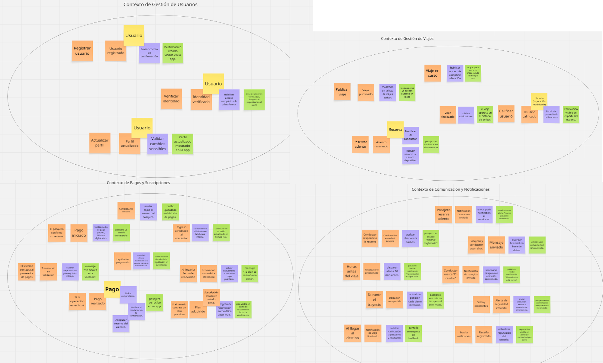


#### [**4.1.1.2. Domain Message Flows Modeling**](#4112-domain-message-flows-modeling)

Se modelaron los flujos de mensajes entre los bounded contexts identificados, utilizando Domain Storytelling para representar eventos clave como la actualización de estados, la confirmación de reservas y las notificaciones de disponibilidad.

##### **Caso 1: Reserva de viaje y pago exitoso**
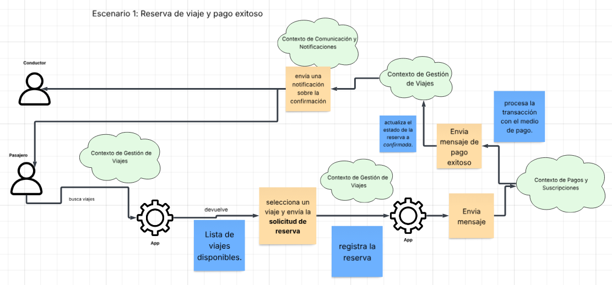

##### **Caso 2: Finalización de viaje y calificación**
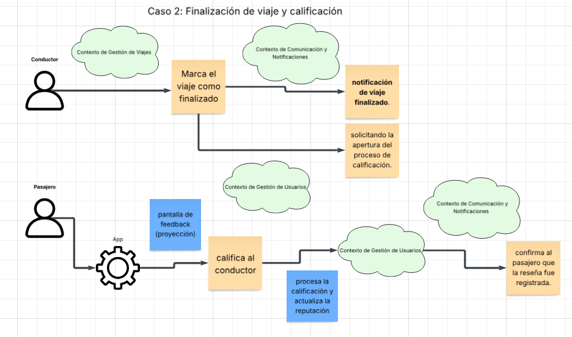

##### **Caso 3: Suscripción Premium**
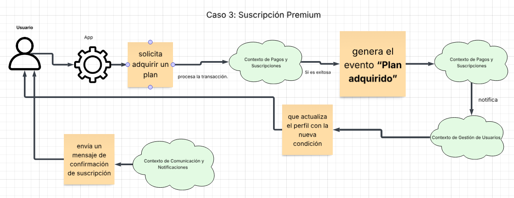

#### [**4.1.1.3. Bounded Context Canvases**](#4113-bounded-context-canvases)

Se definieron cuatro bounded contexts principales: Gestión de Viajes como núcleo encargado de la publicación, reserva y ejecución de trayectos; Pagos y Suscripciones para procesar transacciones y administrar planes; Gestión de Usuarios para autenticación, verificación de identidad y reputación; y Comunicación y Notificaciones para mensajería, alertas y ubicación en tiempo real. Cada uno fue diseñado considerando reglas de negocio, capacidades y dependencias, asegurando límites claros y coherentes para la solución.

##### **Contexto de Gestión de Viajes (Service Design and Planning / Service Execution)**
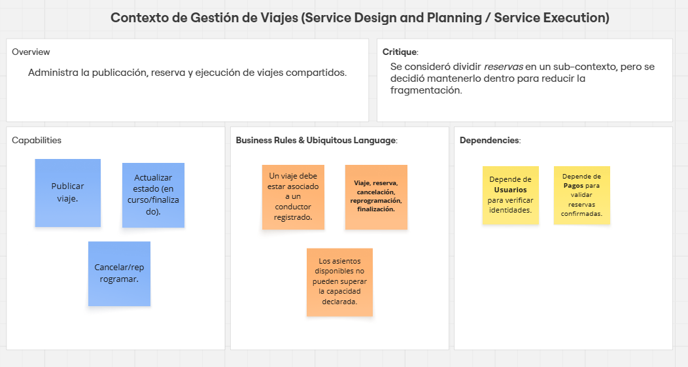

##### **Contexto de Pagos y Suscripciones (Subscriptions and Payment Management)**
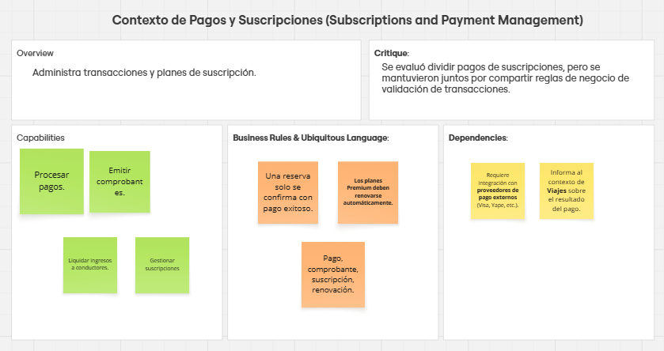

##### **Contexto de Gestión de Usuarios (Identity and Access Management / Profiles and Preferences)**
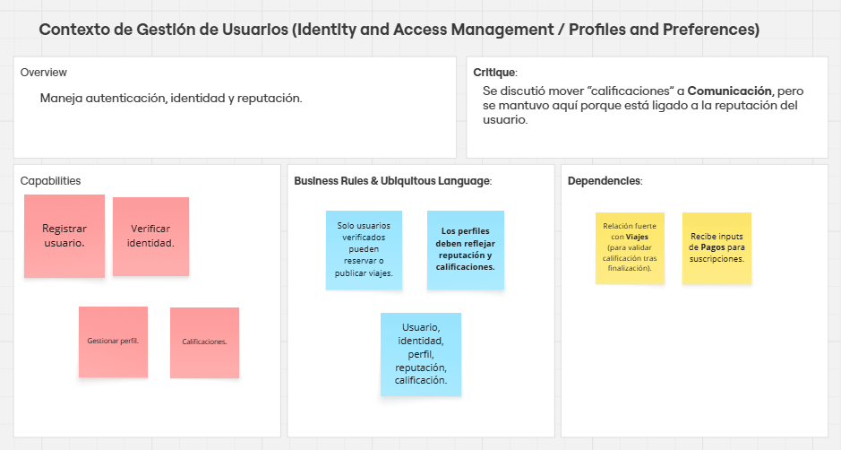

##### **Contexto de Comunicación y Notificaciones (Loyalty and Engagement / Monitoring)**
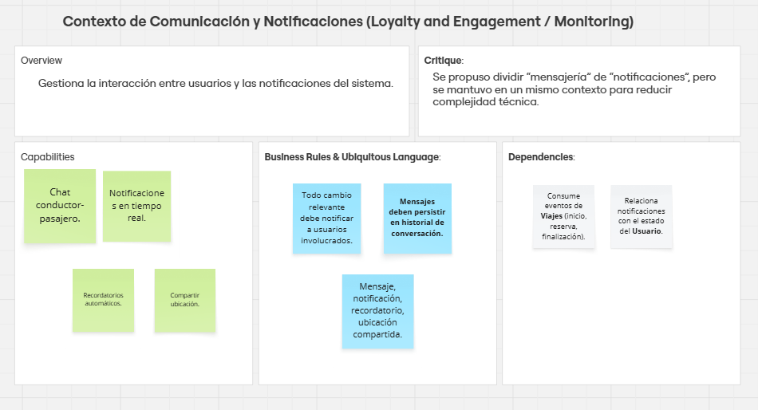

### [**4.1.2. Context Mapping**](#412-context-mapping)

El proceso de Context Mapping se realizó con el fin de visualizar las relaciones estructurales entre bounded contexts y explorar alternativas de organización.

##### Relaciones identificadas:
Usuarios ↔ Viajes: relación de tipo Shared Kernel, ya que comparten el concepto de Usuario verificado.
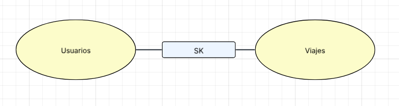

Viajes ↔ Pagos: relación Customer/Supplier, donde Viajes depende del servicio de Pagos para confirmar reservas.
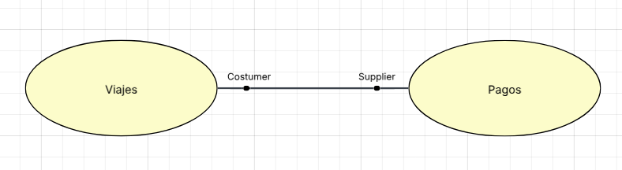

Viajes ↔ Comunicación: relación Conformist, Comunicación consume eventos generados por Viajes.
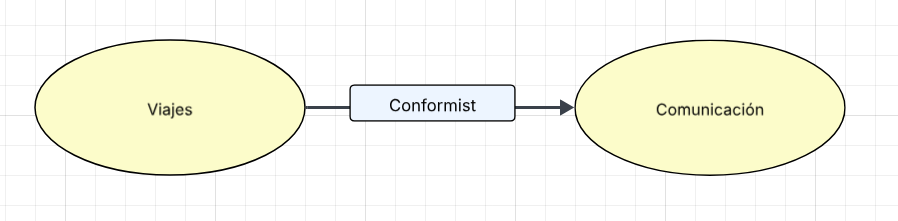

Pagos ↔ Proveedores externos: se aplica un Anti-Corruption Layer para proteger el dominio interno de la lógica de terceros.


Usuarios ↔ Comunicación: relación Customer/Supplier, Comunicación depende de la información de Usuarios (ej. nombre, reputación).
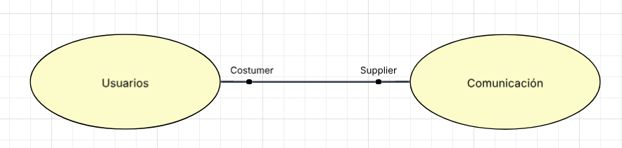

### [**4.1.3 Software Architecture**](#413-software-architecture)

#### [**4.1.3.1. Software Architecture System Landscape Diagram**](#4131-software-architecture-system-landscape-diagram)

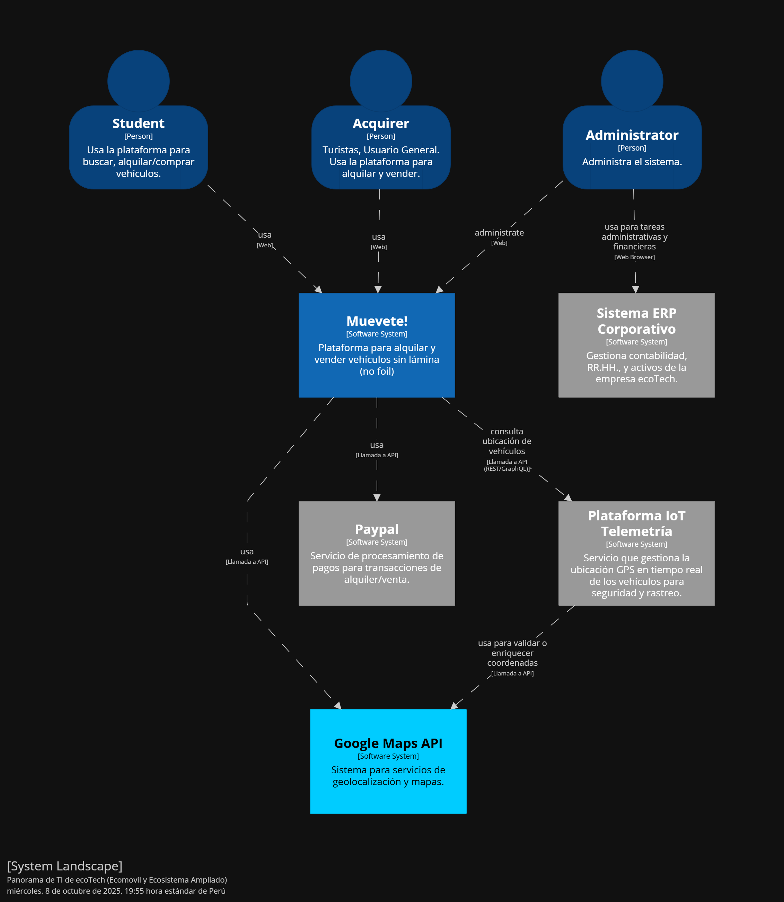

#### [**4.1.3.2. Software Architecture Context Level Diagrams**](#4132-software-architecture-context-level-diagrams)

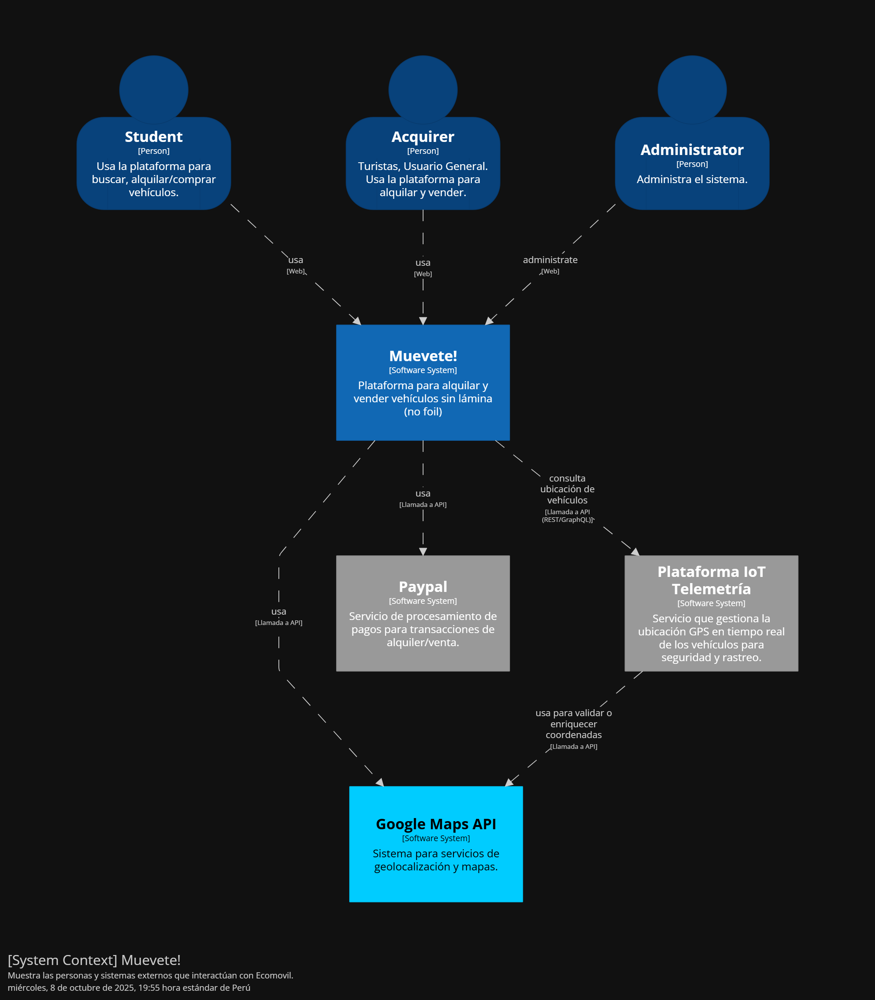

#### [**4.1.3.3. Software Architecture Container Level Diagrams**](#4133-software-architecture-container-level-diagrams)

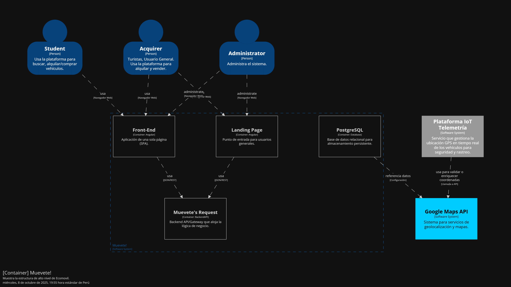

#### [**4.1.3.4. Software Architecture Deployment Diagrams.**](#4134-software-architecture-deployment-diagrams)

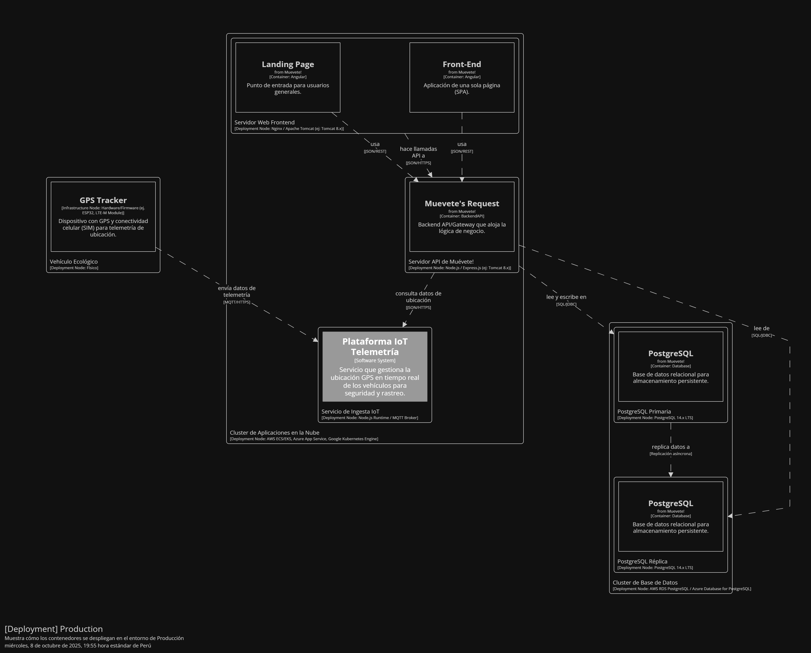

## [**4.2. Tactical-Level Domain-Driven Design.**](#42-tactical-level-domain-driven-design)

### [**4.2.1. Bounded Context: User Management**](#421-bounded-context-bc1)

Este bounded context recopila todas las funcionalidades relacionadas a la gestión de usuarios existentes y nuevos del proyecto. Incluye, por ejemplo, el registro y autenticación de estudiantes, gestión de perfiles, reputación y calificaciones, etc.

## **Clase Principal:** 

`Usuario`

### **Descripción:**

La clase Usuario representa a un usuario dentro de la plataforma, ya sea un conductor o pasajero.

### **Atributos:**

| Atributo       | Descripción                                                              |
| -------------- | ------------------------------------------------------------------------ |
| `nombre: String`      | Almacena el nombre del usuario.                                            |
| `email: String`       | Almacena la dirección de correo electrónico del usuario.                   |
| `contraseña: String`  | Almacena la contraseña del usuario.                                        |
| `rol: Rol`            | Define el rol del usuario en la plataforma (conductor o pasajero).         |
| `verificado: Boolean` | Indica si el usuario ha verificado su identidad.                           |

### **Relaciones**

- **Composición**: `Evaluación` (Un **usuario** puede realizar varias evaluaciones sobre los viajes que toma o proporciona, formando una relación de composición).
- **Agregación**: `Viaje` (El **usuario** como pasajero puede estar asociado a varios viajes, pero los viajes no dependen exclusivamente de él, ya que pueden tener otros pasajeros).
- **Agregación**: `Reserva` (El **usuario** puede realizar múltiples reservas a lo largo del tiempo, pero cada reserva pertenece a un usuario específico).
- **Agregación**: `Pago` (El **usuario** puede realizar varios pagos a lo largo del tiempo, cada uno relacionado con una reserva).

### **Métodos:**

| Método                   | Descripción                                                                        |
| ------------------------ | ---------------------------------------------------------------------------------- |
| `registrarse(): void`    | Método para registrar a un nuevo usuario en la plataforma.                        |
| `iniciarSesion(): void`  | Método para que el usuario inicie sesión en la plataforma.                        |
| `verificarIdentidad(): void` | Verifica la identidad del usuario a través de documentos o información adicional.

---

## **Clases Relacionadas:**

`Evaluación`

### **Descripción:**

La clase Evaluación permite a los usuarios calificar y dejar comentarios sobre sus experiencias de viaje.

### **Atributos:**

| Atributo       | Descripción                                              |
| -------------- | -------------------------------------------------------- |
| `calificación: int` | Almacena la calificación numérica del viaje (por ejemplo, de 1 a 5). |
| `comentario: String` | Almacena los comentarios opcionales sobre el viaje. |
| `evaluador: Usuario` | Almacena la información del usuario que realiza la evaluación. |
| `viaje: Viaje`       | Almacena la información del viaje evaluado.         |

### **Métodos:**

| Método                 | Descripción                                              |
| ---------------------- | -------------------------------------------------------- |
| `calificar(): void`    | Permite al usuario dejar una calificación sobre el viaje.|
| `dejarComentario(): void` | Permite al usuario dejar un comentario opcional sobre el viaje.|

<br>

`Pasajero`

### **Descripción:**

La clase Pasajero es una extensión de Usuario y representa a los usuarios que buscan y reservan viajes.

### **Métodos:**

| Método                   | Descripción                                                   |
| ------------------------ | ------------------------------------------------------------- |
| `buscarViaje(): void`    | Permite al pasajero buscar viajes disponibles en la plataforma.|
| `reservarViaje(): void`  | Permite al pasajero reservar un asiento en un vehículo disponible.|

---

#### [**4.2.1.1. Domain Layer**](#4211-domain-layer)

Consideramos que la clase principal de este bounded context (Usuario), nos permite evaluar y gestionar actualizaciones de reputaciones e información sensible de nuestros usuarios, así como también para registrar en los dispositivos IoT de nuestro proyecto.

### **Reglas de Negocio**

- **Componentes Obligatorios:** Nuestro dispositivo IoT debe incluir:
  - Sensor de localización
  - Sensor de alerta

- **Condiciones de Operación:** Para la correcta operabilidad del dispositivo, necesita:
  - Tener una conexión estable y activa a Internet con el fin de no interrumpir el flujo y recolección de datos en vivo.
  - Vincularse con la cuenta del usuario conductor.


#### [**4.2.1.2. Interface Layer**](#4212-interface-layer)

#### **Entities**

- Usuario: Representa a un conductor o pasajero en la aplicación.

#### **Value Objects**

- Verificado: Representa el estado de validación de identidad del usuario dentro de la plataforma.
- Rol: Representa el tipo de usuario en la plataforma, como conductor o pasajero.

#### **Enums**

- Verificado: Representa el estado de validación de identidad del usuario dentro de la plataforma.
- Rol: Representa el tipo de usuario en la plataforma, como conductor o pasajero.

#### **Factories**

- UserFactory: Fabrica para crear instancias de usuarios.
- VehicleFactory: Fabrica para crear instancias de viajes de un vehiculo.

#### **Interfaces**

- UserRepository: Interfaz para gestionar usuarios.
- VehicleRepository: Interfaz para gestionar vehiculos y sus estados.


#### [**4.2.1.3. Application Layer**](#4213-application-layer)

A continuación, presentaremos las interfaces que creamos para ser consumidas tanto por nuestra aplicación, como por nuestro dispositivo de localización IoT.

- LocationDeviceController: Gestiona, en su totalidad, las funciones que ofrece nuestro dispositivo, así como cualquier transacción que realice.

Siguiendo con el enfoque de Domain-Driven Design, contamos con commandHandlers y  eventHandlers que manejarán las solicitudes y transacciones realizadas por el controlador del dispositivo IoT.

- CreateLocationDeviceCommandHandler: Gestiona la creación de un nuevo dispositivo IoT.
- LocationDeviceCreatedEventHandler: Verifica el estado de creación de un nuevo dispositivo IoT.

#### [**4.2.1.4. Infrastructure Layer**](#4214-infrastructure-layer)

Por último, tenemos las clases que ayudarán con la conexión de microservicios de nuestra aplicación:

- TrackingNotificationSystem: Proveedor de servicios externos de localización actual de un usuario.

#### [**4.2.1.5. Bounded Context Software Architecture Component Level Diagrams**](#4215-bounded-context-software-architecture-component-level-diagrams)


#### [**4.2.1.6. Bounded Context Software Architecture Code Level Diagrams**](#4216-bounded-context-software-architecture-code-level-diagrams)


##### [**4.2.1.6.1. Bounded Context Domain Layer Class Diagrams**](#42161-bounded-context-domain-layer-class-diagrams)


##### [**4.2.1.6.2. Bounded Context Database Design Diagram**](#42162-bounded-context-database-design-diagram)


---

# [**Capítulo V: Solution UI/UX Design.**](#capítulo-v-solution-ui-ux-design)

En este capítulo describimos las directrices de diseño y estilo para el producto, asegurando una experiencia visual coherente y atractiva para el usuario.

## [**5.1. Style Guidelines.**](#style-guidelines)
En esta sección se describen las pautas generales de estilo que guían la apariencia visual del producto, incluyendo el uso de colores, tipografía y espaciado.

### [**5.1.1. General Style Guidelines.**](#general-style-guidelines)
Las directrices generales aseguran una estética que refuerza la marca y proporciona claridad visual para los usuarios.

#### Historia de la marca
La marca busca transmitir modernidad y profesionalismo, reflejando estos valores en cada elemento visual del diseño.

#### Misión
Proporcionar a los usuarios una experiencia fluida y atractiva, con interfaces claras y consistentes.

#### Visión
Ser reconocidos como una marca que combina funcionalidad y estilo en el diseño de productos digitales.

#### Brand Name
El nombre de la marca es un elemento clave de nuestra identidad, representando los valores fundamentales de la empresa.

#### Colores
La paleta de colores está diseñada para proporcionar un equilibrio visual. Utilizamos una combinación de tonos brillantes y neutros para transmitir profesionalismo y modernidad.


#### Tipografía
Usamos la tipografía **Roboto** en diferentes pesos para establecer jerarquía visual y garantizar una legibilidad óptima. El color de la letra principal es `#404040`.


#### Espaciado
El espaciado entre elementos visuales asegura una estructura clara y organizada, ayudando a los usuarios a navegar por el contenido de forma fluida.

- **Tamaño de letra**: Las fuentes varían desde 12px hasta 98px según la jerarquía del texto.
- **Interlineado**: Mantenemos un interlineado proporcional para mejorar la legibilidad.

### [**5.1.2. Web Style Guidelines.**](#web-style-guidelines)

Las pautas de estilo para la web están diseñadas para asegurar que el diseño sea funcional y atractivo tanto en dispositivos móviles como en pantallas grandes. Incluir consistencia en colores, tipografías y espaciado es clave para mantener la identidad visual en todas las plataformas.

## [**5.2. Information Architecture.**](#information-architecture)

En esta sección, se describe cómo se organizará el contenido en la plataforma **Muevete!**, tanto en la web como en las aplicaciones móviles. Se busca que la estructura sea intuitiva para los estudiantes universitarios, permitiendo una navegación fluida y el acceso rápido a las principales funcionalidades de la plataforma.

<hr>

### [**5.2.1. Organization Systems.**](#organization-systems)

El Sistema de Organización de **Muevete!** está diseñado para facilitar la interacción entre el usuario y la plataforma, asegurando que los estudiantes puedan encontrar y utilizar los servicios clave, como la búsqueda de viajes o la oferta de plazas en vehículos.

- **Jerarquía Visual**: La página principal destacará las acciones más importantes para el usuario, como “Buscar viaje” y “Publicar viaje”, con énfasis en botones de llamada a la acción que lleven a estas secciones.
- **Organización Secuencial**: Se aplicará a procesos clave como el registro de usuario, reserva de un viaje y configuración de perfil. Estos procesos se guiarán paso a paso, asegurando que los usuarios completen cada tarea sin problemas.
- **Organización Matricial**: Los filtros de búsqueda permitirán a los usuarios seleccionar viajes según el tipo de vehículo, horario y calificaciones del conductor, haciendo que sea más fácil encontrar un viaje que se ajuste a sus necesidades.
- **Esquemas de Categorización**: La categorización de la información podrá hacerse por orden alfabético (al buscar conductores por nombre), cronológico (al organizar las reservas según la fecha), o por audiencia (al segmentar entre conductores y pasajeros).

<br>

### [**5.2.2. Labeling Systems.**](#labeling-systems)

En **Muevete!**, las etiquetas se diseñarán para ser claras, directas y comprensibles para los estudiantes, priorizando una navegación simple y una experiencia de usuario intuitiva.

### Etiquetas:
- **Inicio**: Al hacer clic en el logo de Muevete!, los usuarios serán redirigidos a la página principal.
- **Buscar Viaje**: Opción en el menú principal que permite a los estudiantes buscar viajes disponibles en su universidad.
- **Publicar Viaje**: Los usuarios con vehículo propio podrán acceder a esta opción para publicar su ruta y disponibilidad de asientos.
- **Reservas Actuales**: Sección donde los usuarios pueden ver y gestionar sus reservas actuales.
- **Perfil**: Permite a los usuarios gestionar sus datos personales, verificar su identidad y ver su historial de viajes.

Una vez que los usuarios se registren y accedan a su cuenta, aparecerán nuevas etiquetas como:
- **Mis Viajes**: Un lugar donde los usuarios pueden revisar sus reservas activas y pasadas.
- **Calificar Conductores**: Opción que aparece tras la finalización de un viaje, permitiendo dejar comentarios y puntuaciones.

<br>

### [**5.2.3. SEO Tags and Meta Tags.**](#seo-tags-and-meta-tags)

Los SEO Tags y Meta Tags son esenciales para mejorar la visibilidad de **Muevete!** en los motores de búsqueda.

### Para la Landing Page:
```html
<meta charset="UTF-8">
<meta name="viewport" content="width=device-width, initial-scale=1.0">
<title>Muevete! - Carpooling para Estudiantes Universitarios</title>
<meta name="description" content="Muevete! es la plataforma de carpooling exclusiva para estudiantes universitarios, enfocada en la seguridad, sostenibilidad y economía colaborativa.">
<meta name="keywords" content="carpooling universitario, compartir autos estudiantes, movilidad sostenible, transporte colaborativo">
<meta name="author" content="Muevete! Team">
```
### Para la Aplicación Web:
```html
<meta charset="UTF-8">
<meta name="viewport" content="width=device-width, initial-scale=1.0">
<title>Muevete! - Comparte tu auto con otros estudiantes universitarios</title>
<meta name="description" content="Con Muevete!, puedes compartir tu auto con otros estudiantes universitarios y reducir tus gastos de transporte mientras ayudas al medio ambiente.">
<meta name="keywords" content="carpooling estudiantes, compartir auto universidad, transporte sostenible, viaje colaborativo">
<meta name="author" content="Muevete! Team">
```

<br>

### [**5.2.4. Searching Systems.**](#searching-systems)

El sistema de búsqueda en Muevete! facilitará a los usuarios encontrar viajes disponibles de forma rápida y efectiva. La funcionalidad de búsqueda incluirá:

Búsqueda por Universidad: Los estudiantes podrán buscar viajes que conecten con su universidad específica.
Filtros de Búsqueda: Los usuarios podrán filtrar los resultados por tipo de vehículo, horario de salida, calificación del conductor y disponibilidad de plazas.
Organización de Resultados: Los resultados se podrán ordenar de manera alfabética, por hora de salida o por la proximidad del conductor al punto de recogida.


<br>

### [**5.2.5. Navigation Systems.**](#navigation-systems)

El sistema de navegación de Muevete! estará diseñado para que los usuarios puedan encontrar la información y realizar las acciones deseadas con el mínimo esfuerzo.

Navegación Principal: El menú superior incluirá accesos rápidos a las funciones clave: "Buscar Viaje", "Publicar Viaje", "Reservas Actuales" y "Perfil".
Navegación Móvil: En la versión móvil, el menú será desplegable para ahorrar espacio y mostrar solo las opciones más importantes de manera compacta. Los usuarios podrán regresar a la página de inicio pulsando el logo de Muevete!.
Navegación Secundaria: En secciones como el perfil, habrá opciones adicionales para gestionar la cuenta, verificar la identidad o ajustar preferencias de notificaciones.


<br>

---

## [**5.3. Landing Page UI Design**](#landing-page-ui-design)

<hr>
<td align="center">
En esta sección, presentamos el diseño de la interfaz de usuario
de la landing page para Muevete! El diseño se ha desarrollado teniendo
en cuenta la experiencia del usuario y la accesibilidad tanto en
versiones de escritorio como móviles. El objetivo principal es
proporcionar una navegación clara y atractiva. </td>

### [**5.3.1. Landing Page Wireframe.**](#landing-page-wireframe)

<td align="center">
A continuación, mostramos los wireframes de la landing page, 
los cuales representan la estructura básica y el layout sin 
elementos gráficos detallados. Estos sirven como una guía inicial
para el diseño visual, asegurando que todos los elementos
necesarios estén presentes y correctamente organizados.
</td>

Enlace a los wireframes de la Landing Page en Figma:

[Landing Page Wireframes Link](https://www.figma.com/design/8HLFLOPVBAOUkQcOi54BjZ/GoUni-TSP?node-id=0-1&p=f&t=03GYsMHZup0zyO9S-0)

#### Wireframe de la Landing Page en Figma:

#### Versión Desktop:

##### Wireframe de la página principal:

Wireframe de la sección Header:


Wireframe de la sección Hero:


Wireframe de la sección How It Works:


Wireframe de la sección Benefits of GoUni:


Wireframe de la sección Security:


Wireframe de la sección Plans:


Wireframe de la sección Our Apps and Portals:


Wireframe de la sección Contact Us:


Wireframe de la sección Footer:


##### Wireframe de la sección Sobre Nosotros:

Wireframe de la sección Header:


Wireframe de la sección Who We Are:


Wireframe de la sección Our Sponsor:


Wireframe de la sección whyGoUni?:


Wireframe de la sección Our Team:


Wireframe de la sección Footer:


##### Versión Mobile:

##### Wireframe de la página principal:

Wireframe de la sección Header:


Wireframe de la sección How It Works:


Wireframe de la sección Benefits of GoUni:


Wireframe de la sección Security:


Wireframe de la sección Plans:


Wireframe de la sección Our Apps and Portals:


Wireframe de la sección Contact Us:


Wireframe de la sección Footer:


##### Wireframe de la sección Sobre Nosotros:

Wireframe de la sección Header:


Wireframe de la sección Why GoUni?:


Wireframe de la sección Our Sponsors:


Wireframe de la sección Our Team:


Wireframe de la sección Footer:


### [**5.3.2. Landing Page Mock-up.**](#landing-page-mock-up)

<td align="center">
Esta sección presenta los mockups de la landing page,
que ilustran el diseño final con detalles gráficos, tipografía,
y color. Los mockups son fundamentales para visualizar cómo se
verá la página final y para realizar ajustes antes del desarrollo.
</td>

Enlace a la mockup de la Landing Page en Figma:

#### Mockups de la Landing Page en Figma:

##### Versión Desktop:

#### Mockups de la página principal

Mockup de la sección Header:


Mockup de la sección Hero:


Mockup de la sección How It Works:


Mockup de la sección Benefits of GoUni:


Mockup de la sección Security:


Mockup de la sección Plans:


Mockup de la sección Our Apps and Portals:


Mockup de la sección Contact Us:


Mockup de la sección Footer:


#### Mockups de la sesion Sobre Nosotros:

Mockup de la sección Header:


Mockup de la sección Who We Are:


Mockup de la sección Why GoUni?:


Mockup de la sección Our Sponsors:


Mockup de la sección Footer:


##### Versión Mobile:

#### Mockups de la página principal

Mockup de la sección Header:


Mockup de la sección How It Works:


Mockup de la sección Benefits of GoUni:


Mockup de la sección Security:


Mockup de la sección Plans:


Mockup de la sección Our Apps and Portals:


Mockup de la sección Contact Us:


Mockup de la sección Footer:


##### Mockups de la sesion Sobre Nosotros:

Mockup de la sección Header:


Mockup de la sección Why GoUni?:


Mockup de la sección Our Sponsors:


Mockup de la sección Footer:


## [**5.4. Web Applications UX/UI Design.**](#web-applications-uxui-design)

En esta sección, presentamos el diseño de la interfaz de usuario de las aplicaciones web de GoUni, que incluyen el inicio de sesión, la creación de cuenta, la búsqueda de viajes, la reserva de asientos y la calificación de conductores. El diseño se ha desarrollado teniendo en cuenta la experiencia del usuario y la accesibilidad en diferentes dispositivos.

### [**5.4.1. Web Applications Wireframes.**](#web-applications-wireframes)

Enlace a los wireframes de las aplicaciones web en Figma:

[Link Web Applications Wireframes](https://www.figma.com/design/sDl1xClQAtYSkXhEGEgjb7/Landing-Page-GoUni---TSP?node-id=0-1&p=f&t=zJdMUNIpjRHzxDl7-0)

#### Wireframes de las Aplicaciones Web en Figma:

Wireframe de la página de inicio de sesión:


Wireframe de la página de creación de cuenta:


Wireframe de la página de creación de cuenta elija una opcion:


Wireframe de la página de creación de cuenta conductor:


Wireframe de la página de creación de cuenta estudiante:


Wireframe de la página de inicio:


Wireframe de la página de servicios:


Wireframe de la página de planes de suscripcion:


Wireframe de la página de pagos:


Wireframe de maps:


Wireframe de la página de reservas:


Wireframe de la página de reserva descripcion:


Wireframe de la página de confirmacion:


Wireframe de la página de tus reservas:


Wireframe de la página de chat:


Wireframe de la página de calificacion:


### [**5.4.2. Web Applications Wireflow Diagrams.**](#web-applications-wireflow-diagrams)

Los Wireflow Diagrams son diagramas que representan la secuencia de pasos que un usuario sigue al interactuar con la aplicación web. Estos diagramas muestran cómo los usuarios navegan por la plataforma, desde el inicio de sesión hasta la reserva de un viaje.

#### Wireflow Diagrams de las Aplicaciones Web en LucidChart Iniciar Sesion:


Wireflow Diagrams de las Aplicaciones Web en LucidChart Plan:


Wireflow Diagrams de las Aplicaciones Web en LucidChart Reservar Viaje:


### [**5.4.3. Web Applications Mock-ups.**](#web-applications-mock-ups)

En esta sección, presentamos los mockups de la aplicación web de GoUni, que ilustran el diseño final con detalles gráficos, tipografía y color. Los mockups son fundamentales para visualizar cómo se verá la aplicación final y para realizar ajustes antes del desarrollo.

Enlace a la mockup de la App Web en Figma:
[Link Web Applications Mockups](https://www.figma.com/design/sDl1xClQAtYSkXhEGEgjb7/Landing-Page-GoUni---TSP?node-id=0-1&p=f&t=zJdMUNIpjRHzxDl7-0)


Inicio de sesión:


Creación de cuenta:


Elegir entre ser conductor o pasajero:


Registro de estudiante:


Registro de conductor:


Inicio de la Web Applications:


Servicios de la Web Applications:


Planes de la Web Applications:


Pagos del plan de la Web Applications:


Mapa de la Web Applications:


Reservas de la Web Applications:


Reserva descripción de la Web Applications:


Confirmación de reserva de la Web Applications:


Tus reservas de la Web Applications:


Chat de la Web Applications:


Calificación de la Web Applications:


### [**5.4.4. Web Applications User Flow Diagrams.**](#web-applications-user-flow-diagrams)

Los User Flow Diagrams son diagramas que representan la secuencia de pasos que un usuario sigue al interactuar con la aplicación web. Estos diagramas muestran cómo los usuarios navegan por la plataforma, desde el inicio de sesión hasta la reserva de un viaje.

Inicio de sesión y creación de cuenta:


Plan de pago:


Realizar reserva:


## [**5.5. Web Applications Prototyping.**](#web-applications-prototyping)

<hr>
En esta sección, presentamos los prototipos interactivos de las aplicaciones web de GoUni. Los prototipos permiten a los usuarios navegar por las diferentes pantallas y funcionalidades, simulando la experiencia de uso de la aplicación antes de su desarrollo.


Además, se adjunta el enlace al video completo de la presentación del prototipo:

[Link Video Applications Prototyping](https://upcedupe-my.sharepoint.com/:v:/g/personal/u202218664_upc_edu_pe/EWGbMcHowddPkLKM-izeDnkBu8xRzmdoXugfgBBKk-ylHA?e=t1N4fR&nav=eyJyZWZlcnJhbEluZm8iOnsicmVmZXJyYWxBcHAiOiJTdHJlYW1XZWJBcHAiLCJyZWZlcnJhbFZpZXciOiJTaGFyZURpYWxvZy1MaW5rIiwicmVmZXJyYWxBcHBQbGF0Zm9ybSI6IldlYiIsInJlZmVycmFsTW9kZSI6InZpZXcifX0%3D)

Link Web Applications Prototyping:

[Link Web Applications Prototyping](https://www.figma.com/proto/EwjGSJ6rrm0CnMdTbftA6k/Web-Application-Wireframe---Mock-Up?page-id=0%3A1&node-id=15-495&starting-point-node-id=15%3A482)

---
# [**Capítulo VI: Product Implementation, Validation & Deployment.**](#capitulo-vi-productimplementation-validation-deployment) 

## [**6.1. Software Configuration Management.**](#61-software-configuration-management) 
### [**6.1.1. Software Development Environment Configuration.**](#611-software-development-environment-configuration) 
### [**6.1.2. Source Code Management.**](#612-source-code-management)
### [**6.1.3. Source Code Style Guide & Conventions.**](#613-source-code-style-guide--conventions) 
### [**6.1.4. Software Deployment Configuration.**](#614-software-deployment-configuration)

## [**6.2. Landing Page, Services & Applications Implementation.**](#62-landing-page-services--applications-implementation) 
### [**6.2.1. Sprint 1.**](#621-sprint-1) 

Un Sprint en el contexto de Scrum es un periodo de tiempo fijo y breve en el que el equipo se enfoca en realizar todas las tareas necesarias para lograr el objetivo del producto definido, denominado "Product Goal" (Scrum Alliance, 2024).

#### [**6.2.1.1. Sprint Planning 1.**](#6211-sprint-planning-1) 

Un sprint es un intervalo breve y definido durante el cual se completan tareas o actividades específicas dentro de un proyecto, como se aplica en metodologías ágiles como Scrum. El Sprint #1, que comienza el 22 de septiembre de 2025, tiene como objetivo diseñar una landing page atractiva para "Muévete!" y una primera versión de la aplicación web, en conjunto con el backend de la misma, con los requerimientos core de nuestro producto. Esta primera página debe captar la atención de los visitantes y resaltar los principales beneficios de nuestro producto, con el fin de que más usuarios se interesen en nuestra solución y utilicen nuestra aplicación web.

<table>
     <tr> 
        <th>  Sprint #  </th>
        <th> Sprint 1 </th>
     </tr>
     <tr> 
        <td style="font-weight: bold;" colspan="7"> Sprint Planing Background</td>
     </tr>
     <tr>
       <td style="font-weight: bold;"> Date </td>
       <td>  22/09/2025 </td>
     </tr>
     <tr>
       <td style="font-weight: bold;"> Time </td>
       <td> 19:00 horas (GMT-5) </td>
     </tr>
     <tr>
       <td style="font-weight: bold;"> Location </td>
       <td> Modalidad remota a través de Discord <td>
     </tr>
      <tr>
        <td style="font-weight: bold;"> Prepared By </td>
        <td> Onofre Ruíz, Carlos Jesús <td>
     </tr>
        <tr>
        <td style="font-weight: bold;"> Attendees (to planning meeting) </td>
        <td> 
            <br>
             Hidalgo Lopez, Mathias Adriano
            <br>
             Onofre Ruiz, Carlos Jesus
            <br>
             Mendez Vargas, Sebastian Orlando
            <br>
             Travezaño Patiño, Eduard Gedeon
        <td>
     </tr>
     <tr>
        <td style="font-weight: bold;"> Sprint 0 Review Summary </td>
        <td> Dado que este es nuestro primer sprint de desarrollo, no hay un resumen de revisión del sprint disponible. <td>
     </tr>
     <tr>
        <td style="font-weight: bold;"> Sprint 0 Retrospective Summary </td>
        <td> Dado que este es nuestro primer sprint de desarrollo, aún no hemos identificado planes de mejora.<td>
     </tr>
     <tr> 
        <td style="font-weight: bold;" colspan="7"> Sprint Goal & User Stories</td>
     </tr>
       <tr>
          <td style="font-weight: bold;"> Sprint 1 Goal</td>
          <td>  En este sprint, se planea implementar la landing page con las secciones de inicio de sesión, hero y elementos de orientación para el usuario, como el footer y "About", y por otro lado, implementar la aplicación web y backend con las mejores prácticas escalabilidad, diseño ya arquitectura del código en general. Al finalizar el sprint, la landing page y la aplicación web deben estar desplegadas en GitHub, y cualquier usuario debería poder acceder y ver la página mediante un enlace. <td>
      </tr>
       <tr>
          <td style="font-weight: bold;"> Sprint 1 Velocity </td>
          <td>  86  <td>
      </tr>
      <tr>
          <td style="font-weight: bold;"> Sum of Story Points </td>
          <td> 86 <td>
      </tr>

  </table>

<table>
  <tr>
    <th>Team Member (Last Name, First Name)</th>
    <th>GitHub Username</th>
    <th>Implementación de Landing Page (L/C)</th>
    <th>Diseño de Frontend (L/C)</th>
    <th>Implementación de Frontend (L/C)</th>
    <th>Implementación de Backend (L/C)</th>
  </tr>
  <tr>
    <td>Hidalgo López, Mathias Adriano</td>
    <td>mathiasadriano</td>
    <td>L</td>
    <td>C</td>
    <td>C</td>
    <td>C</td>
  </tr>
  <tr>
    <td>Onofre Ruíz, Carlos Jesús</td>
    <td>OnofreGH</td>
    <td>C</td>
    <td>C</td>
    <td>C</td>
    <td>L</td>
  </tr>
  <tr>
    <td>Méndez Vargas, Sebastian Orlando</td>
    <td>el-tres-palabritas</td>
    <td>C</td>
    <td>L</td>
    <td>C</td>
    <td>C</td>
  </tr>
  <tr>
    <td>Travezaño Patiño, Eduard Gedeon</td>
    <td>EduardTrave</td>
    <td>C</td>
    <td>C</td>
    <td>L</td>
    <td>C</td>
  </tr>
</table>

#### [**6.2.1.3. Sprint Backlog 1.**](#6213-sprint-backlog-1) 

En el primer sprint backlog, el equipo se propuso comenzar y finalizar la landing page y aplicación web en su totalidad. Para organizar y gestionar a los miembros del equipo, se utilizó Trello, una herramienta que permitió dividir las user stories en tareas manejables y asignarlas a los miembros según sus habilidades.


<table style="width:100%; height:auto; border-collapse: collapse;">
   <tr>
      <th colspan="4"> Sprint # </th>
      <th colspan="7"> Sprint 1 </th>
   </tr>
   <tr>
     <th colspan="4"> User Story </th>
     <th colspan="7"> Work-Item / Task </th>
   </tr>
   <tr>
      <th colspan="10"> Implementación de Landing Page </th>
   </tr>
   <tr>
     <th> Id </th>
     <th colspan="3"> Title </th>
     <th> Task Id </th>
     <th> Title </th>
     <th> Description </th>
     <th> Estimation (Hours) </th>
     <th> Assigned To </th>
     <th> Status (To-do / In-Process / To-Review / Done) </th>
   </tr>
   <tr>
      <th> US01 </th>
     <th colspan="3"> Barra de navegación en la Landing Page </th>
      <th> UT01 </th>
     <th> Sección de la barra de navegación </th>
     <th> Desarrollar el navbar de la landing page de EcoMovil y asegurar que las opciones de navegación sean intuitivas </th>
     <th> 1 </th>
     <th> Mathias Hidalgo </th> 
     <th> Done </th>
   </tr>
   <tr>
      <th> US01 </th>
     <th colspan="3"> Barra de navegación en la Landing Page </th>
      <th> UT02</th>
     <th> Mejoras en la barra de navegación </th>
     <th> Mejorar la interacción del usuario con el navbar añadiendo animaciones o transiciones suaves </th>
     <th> 5 </th>
     <th> Mathias Hidalgo </th> 
     <th> Done </th>
   </tr>
   <tr>
      <th> US02 </th>
     <th colspan="3"> Sección Hero en la Landing Page </th>
      <th> UT03</th>
     <th> Sección de Hero </th>
     <th> Crear una sección destacada con una imagen impactante y un título atractivo en la landing page </th>
     <th> 8 </th>
     <th> Sebastian Méndez </th> 
     <th> Done </th>
   </tr>
   <tr>
      <th> US02 </th>
     <th colspan="3"> Sección Hero en la Landing Page </th>
      <th> UT04 </th>
     <th> Ajustes de la sección de Hero </th>
     <th> Ajustar el diseño y la responsividad de la sección hero para diferentes tamaños de pantalla </th>
     <th> 4 </th>
     <th> Sebastian Méndez </th> 
     <th> Done </th>
   </tr>
   <tr>
      <th> US03 </th>
     <th colspan="3"> Sección Footer en la Landing Page </th>
      <th> UT05 </th>
     <th> Sección de pie de página </th>
     <th> Desarrollar la sección del pie de página con enlaces a la información sobre el equipo y los términos de uso </th>
     <th> 2 </th>
     <th> Mathias Hidalgo </th> 
     <th> Done </th>
   </tr>
   <tr>
      <th> US03 </th>
     <th colspan="3"> Sección Footer en la Landing Page </th>
      <th> UT06 </th>
     <th> Funcionalidad del pie de página </th>
     <th> Asegurar que los enlaces en el pie de página sean funcionales y estén correctamente organizados </th>
     <th> 5 </th>
     <th> Mathias Hidalgo </th> 
     <th> Done </th>
   </tr>
   <tr>
      <th> US04 </th>
     <th colspan="3"> Sección "About Us" en la Landing Page </th>
      <th> UT07 </th>
     <th> Sobre nosotros sección </th>
     <th> Implementar la sección "About us" para ofrecer detalles sobre el equipo y la misión de la empresa </th>
     <th> 8 </th>
     <th> Eduard Travezaño </th> 
     <th> Done </th>
   </tr>
   <tr>
      <th> US04 </th>
     <th colspan="3"> Sección "About Us" en la Landing Page </th>
      <th> UT08 </th>
     <th> Sobre nosotros y contenido de la sección </th>
     <th> Agregar contenido detallado sobre la historia y misión de la empresa en la sección "About us" </th>
     <th> 7 </th>
     <th> Eduard Travezaño </th> 
     <th> Done </th>
   </tr>
   <tr>
      <th> US05 </th>
     <th colspan="3"> Sección de Beneficios en la Landing Page </th>
      <th> UT09</th>
     <th> Sección Beneficios </th>
     <th> Desarrollar una sección que resuma las características clave y beneficios de EcoMovil </th>
     <th> 7 </th>
     <th> Mathias Hidalgo </th> 
     <th> Done </th>
   </tr>
   <tr>
      <th> US05 </th>
     <th colspan="3"> Sección de Beneficios en la Landing Page </th>
      <th> UT10 </th>
     <th> Disposición de la sección de beneficios </th>
     <th> Ajustar el diseño y los elementos visuales para una mejor presentación de los beneficios </th>
     <th> 6 </th>
     <th> Mathias Hidalgo </th> 
     <th> Done </th>
   </tr>
   <tr>
      <th> US06 </th>
     <th colspan="3"> Sección de Contacto en la Landing Page </th>
      <th> UT11 </th>
     <th> Sección de contacto </th>
     <th> Agregar la información de contacto del equipo para facilitar la comunicación con los usuarios </th>
     <th> 5 </th>
     <th> Carlos Onofre </th> 
     <th> Done </th>
   </tr>
   <tr>
      <th> US06 </th>
     <th colspan="3"> Sección de Contacto en la Landing Page </th>
      <th> UT12 </th>
     <th> Formulario de contacto </th>
     <th> Implementar un formulario de contacto funcional en la sección </th>
     <th> 5 </th>
     <th> Carlos Onofre </th> 
     <th> Done </th>
   </tr>
   <tr>
      <th> US07 </th>
     <th colspan="3"> Landing Page Responsive con diferentes dispositivos </th>
      <th> UT13 </th>
     <th> Página de destino adaptable </th>
     <th> Asegurar que la landing page sea completamente funcional y visualmente adecuada en diferentes dispositivos y tamaños de pantalla </th>
     <th> 6 </th>
     <th> Mathias Hidalgo </th> 
     <th> Done </th>
   </tr>
   <tr>
      <th> US07 </th>
     <th colspan="3"> Landing Page Responsive con diferentes dispositivos </th>
      <th> UT14 </th>
     <th> Optimización para dispositivos móviles </th>
     <th> Optimizar el diseño de la página para una mejor experiencia en dispositivos móviles </th>
     <th> 4 </th>
     <th> Mathias Hidalgo </th> 
     <th> Done </th>
   </tr>
   <tr>
      <th colspan="10"> Implementación de Frontend </th>
   </tr>
   <tr>
      <th> US16 </th>
     <th colspan="3"> Sección Crear una cuenta en EcoMovil </th>
      <th> TK01  </th>
     <th> Sección de creación de usuarios</th>
     <th> Desarrollar el Create-User de nuestro front-end de EcoMovil nos permite que el usuario pueda registrarse en la página. </th>
     <th> 1  </th>
     <th> Sebastian Méndez </th> 
     <th> Done </th>
   </tr>
   <tr>
      <th> </th>
     <th colspan="3"></th>
      <th> TK02 </th>
     <th> Validación de formulario </th>
     <th> Implementar validaciones de los formularios para garantizar que la información ingresada sea correcta antes de registrarse. </th>
     <th> 5 </th>
     <th> Sebastian Méndez </th> 
     <th> Done </th>
   </tr>
   <tr>
      <th> US17 </th>
     <th colspan="3"> Sección Inicio de sesión en EcoMovil </th>
      <th> TK03  </th>
     <th> Sección de inicio de sesión</th>
     <th> Implementar el inicio de sesión en nuestro front-end ayuda a que el usuario pueda entrar con su cuenta ya creada. </th>
     <th> 8  </th>
     <th> Sebastian Méndez </th> 
     <th> Done </th>
   </tr>
   <tr>
      <th> </th>
     <th colspan="3"></th>
      <th> TK04 </th>
     <th> Persistencia de la sesión </th>
     <th> Implementar la persistencia de sesión para mantener al usuario logueado mientras navega en la aplicación. </th>
     <th> 4 </th>
     <th> Sebastian Méndez </th> 
     <th> Done </th>
   </tr>
   <tr>
      <th> US18 </th>
     <th colspan="3"> Sección Botón “Elija un plan” </th>
      <th> TK05  </th>
     <th> Botón Sección "Elija un plan" </th>
     <th> La implementación del botón es para que los universitarios puedan comprar una suscripción y registrar sus vehículos menores para que los usuarios puedan alquilarlos. </th>
     <th> 2  </th>
     <th> Eduard Travezaño </th> 
     <th> Done </th>
   </tr>
   <tr>
      <th> </th>
     <th colspan="3"></th>
      <th> TK06 </th>
     <th> Flujo de suscripción </th>
     <th> Implementar el flujo de suscripción para que los usuarios puedan seleccionar un plan y proceder con el pago. </th>
     <th> 7 </th>
     <th> Eduard Travezaño </th> 
     <th> Done </th>
   </tr>
   <tr>
      <th> US19</th>
     <th colspan="3"> Sección Mensaje de “Pago exitoso” </th>
      <th> TK07  </th>
     <th> Mensaje Sección "Pago exitoso" </th>
     <th> Implementar el mensaje es para confirmar al usuario que su pago se realizó correctamente. </th>
     <th> 8  </th>
     <th> Eduard Travezaño </th> 
     <th> Done </th>
   </tr>
   <tr>
      <th> </th>
     <th colspan="3"></th>
      <th> TK08</th>
     <th>Confirmación de pago </th>
     <th> Implementar la lógica de confirmación de pago para asegurar que el usuario reciba un mensaje tras completar su transacción. </th>
     <th> 5 </th>
     <th> Eduard Travezaño </th> 
     <th> Done </th>
   </tr>
   <tr>
      <th> US20</th>
     <th colspan="3"> Implementación de API para Búsqueda Geolocalizada de Vehículos</th>
      <th> TK09  </th>
     <th> Sección de geolocalización </th>
     <th> Implementar una API para Búsqueda Geolocalizada de Vehículos permite que los clientes puedan visualizar en qué punto están los vehículos alquilados. </th>
     <th> 7  </th>
     <th> Eduard Travezaño </th> 
     <th> Done </th>
   </tr>
   <tr>
      <th> </th>
     <th colspan="3"></th>
      <th>TK10 </th>
     <th> Precisión de geolocalización </th>
     <th> Mejorar la precisión de la geolocalización para garantizar que los usuarios puedan ver la ubicación exacta de los vehículos. </th>
     <th> 1 </th>
     <th> Eduard Travezaño </th> 
     <th> Done </th>
   </tr>
   <tr>
      <th> US21 </th>
     <th colspan="3"> Sección Historial de Vehículos </th>
      <th> TK11  </th>
     <th> Sección de Historia del Vehículo </th>
     <th> Agregar un historial de vehículos permite visualizar todos los vehículos que tiene un universitario en alquiler y por alquilar. </th>
     <th> 5 </th>
     <th> Sebastian Méndez </th> 
     <th> Done </th>
   </tr>
   <tr>
      <th> </th>
     <th colspan="3"></th>
      <th>TK12 </th>
     <th> Filtros de historial </th>
     <th> Implementar filtros de búsqueda para que los usuarios puedan ordenar su historial de vehículos por fecha, estado o tipo de vehículo. </th>
     <th> 4 </th>
     <th> Sebastian Méndez </th> 
     <th> Done </th>
   </tr>
   <tr>
     <th> US23 </th>
    <th colspan="3"> Foro de Contactos </th>
      <th> TK13  </th>
      <th> Sección del foro de contacto </th>
      <th> Implementar el foro de contacto ayuda a visualizar las opiniones que tienen los clientes sobre los vehículos. </th>
      <th> 5 </th>
      <th> Sebastian Méndez </th> 
      <th> Done </th>
   </tr>
   <tr>
      <th> </th>
     <th colspan="3"></th>
      <th> TK14 </th>
     <th>Interacción en el foro </th>
     <th> Mejorar la interacción en el foro permitiendo que los usuarios puedan responder y valorar los comentarios. </th>
     <th> 2 </th>
     <th> Sebastian Méndez </th> 
     <th> Done </th>
   </tr>
   <tr>
      <th colspan="10"> Implementación de Backend </th>
   </tr>
      <tr>
      <tr>
         <td rowspan="3">US18</td>
         <td rowspan="3">Bot&oacute;n &ldquo;Elija un plan&rdquo;</td>
      </tr>
      <tr>
         <td>TK17</td>
         <td>Endpoint para redirecci&oacute;n de planes</td>
         <td>Configurar endpoint que gestione la redirecci&oacute;n del bot&oacute;n para mostrar detalles de pago.</td>
         <td>4</td>
         <td>Mathias Hidalgo</td>
         <td>Done</td>            
      </tr>   
      <tr>
         <td>TK18</td>
         <td>L&oacute;gica de control para selecci&oacute;n de planes</td>
         <td>Implementar l&oacute;gica de backend para almacenar selecci&oacute;n de planes en la base de datos.</td>
         <td>8</td>
         <td>Mathias Hidalgo</td>
         <td>Done</td>            
      </tr>      
   </tr>
   <tr>
      <tr>
         <td rowspan="3">US20</td>
         <td rowspan="3">Bot&oacute;n &ldquo;Agregar veh&iacute;culo&rdquo;</td>
      </tr>
      <tr>
         <td>TK19</td>
         <td>Servicio para publicar veh&iacute;culos</td>
         <td>Crear servicio que gestione la publicaci&oacute;n de veh&iacute;culos en la plataforma.</td>
         <td>6</td>
         <td>Carlos Onofre</td>
         <td>Done</td>
      </tr>   
      <tr>
         <td>TK20</td>            
         <td>Validaci&oacute;n de datos para veh&iacute;culo</td>
         <td>Implementar validaci&oacute;n en backend para datos de publicaci&oacute;n de veh&iacute;culo.</td>
         <td>6</td>
         <td>Carlos Onofre</td>
         <td>Done</td>          
      </tr>      
   </tr>
   <tr>
      <tr>
         <td rowspan="3">US26</td>
         <td rowspan="3">B&uacute;squeda de veh&iacute;culos</td>
      </tr>
      <tr>
         <td>TK21</td>
         <td>Filtrar veh&iacute;culos por tipo</td>
         <td>Desarrollar l&oacute;gica de backend para filtrar veh&iacute;culos por tipo.</td>
         <td>6</td>
         <td>Carlos Onofre</td>
         <td>Done</td>
      </tr>   
      <tr>
         <td>TK22</td>            
         <td>Filtrar veh&iacute;culos por ubicaci&oacute;n</td>
         <td>Implementar l&oacute;gica para filtrar veh&iacute;culos por ubicaci&oacute;n en el backend.</td>
         <td>5</td>
         <td>Mathias Hidalgo</td>
         <td>Done</td>          
      </tr>      
   </tr>
   <tr>
      <tr>
         <td rowspan="3">US27</td>
         <td rowspan="3">Crear discusi&oacute;n en el foro</td>
      </tr>
      <tr>
         <td>TK23</td>
         <td>API para creaci&oacute;n de discusiones en foro</td>
         <td>Desarrollar endpoint que permita crear discusiones en el foro.</td>
         <td>6</td>
         <td>Carlos Onofre</td>
         <td>Done</td>
      </tr>   
      <tr>
         <td>TK24</td>            
         <td>Notificaci&oacute;n de respuestas en foro</td>
         <td>Implementar notificaciones en backend para alertar al usuario sobre respuestas.</td>
         <td>5</td>
         <td>Carlos Onofre</td>
         <td>Done</td>          
      </tr>      
   </tr>
   <tr>
      <tr>
         <td rowspan="3">US28</td>
         <td rowspan="3">Actualizar perfil</td>
      </tr>
      <tr>
         <td>TK25</td>
         <td>API para actualizaci&oacute;n de perfil</td>
         <td>Crear servicio para permitir a usuarios actualizar sus datos de perfil.</td>
         <td>8</td>
         <td>Mathias Hidalgo</td>
         <td>Done</td>
      </tr>   
      <tr>
         <td>TK26</td>            
         <td>Validaci&oacute;n en backend de perfil de usuario</td>
         <td>Incluir validaci&oacute;n de campos en la actualizaci&oacute;n del perfil desde backend.</td>
         <td>6</td>
         <td>Carlos Onofre</td>
         <td>Done</td>          
      </tr>      
   </tr>
   
</table>

#### [**6.2.1.4. Development Evidence for Sprint Review.**](#6214-development-evidence-for-sprint-review) 

| Repository   | Branch                                      | Commit Id | Commit Message                   | User | Commited on (Date) |
| ------------ | ------------------------------------------- | --------- | -------------------------------- | ------------------- | ------------------ |
| landing-page | main       | b863a40         |        | Mathias Hidalgo | Sep 22, 2025         | 
| landing-page | main       | 36fec62         | feat: add file | Mathias Hidalgo | Sep 22, 2025    |
| landing-page | main       | f827944         | feat: added plans section | Sebastian Mendez | Sep 22, 2025       |
| landing-page | main       | cf2b26c   |feat: Added about section         | Eduard Travezaño| Sep 22, 2025                |
| landing-page | main       | 8404774             |  feat: Added footer section                     | Eduard Travezaño|  Sep 22, 2025 |
| landing-page | main       | b360e5b              |    feat: added header             | Carlos Onofre|      Sep 22, 2025 |
| landing-page | main       | ad8ad4c  |  feat: added how-it-work component     | Carlos Onofre|  Sep 22, 2025 |
| landing-page | main       | 0eb6e8d  |   feat(feature/join): Added join component  | Mathias Hidalgo|   Sep 23, 2025|
| landing-page | main       | 4aa9478  |  feat(feature/main): added main component  | Mathias Hidalgo | Sep 23, 2025|
| landing-page | main       | 50b12a4  |  "feat Merge branch 'feature/plans' into develop"| Mathias Hidalgo | Sep 23, 2025|
| landing-page | main       | b795e73   |  feat: Merged main into develop   | Mathias Hidalgo | Sep 23, 2025|
| landing-page | main       | c0e34a3    |     feat: merged how-it-works into develop | Mathias Hidalgo| Sep 23, 2025 |
| landing-page | main       | 80d39b9 |        feat: merged header into develop   | Mathias Hidalgo |  Sep 23, 2025 |
| landing-page | main       | fc17166 |        feat: merged footer into develop   | Mathias Hidalgo | Sep 23, 2025 |
| landing-page | main       | db8f49d  |   feat: merged about into develop         | Mathias Hidalgo | Sep 23, 2025 |
| landing-page | main       | d64296f   |      Create jekyll-gh-pages.yml          | Mathias Hidalgo |  Sep 23, 2025 |
| landing-page | main       | e4b6d2a |    feat: refactor index.html         | Mathias Hidalgo| Sep 23, 2025  |
| landing-page | main       | 5721546 |        feat: merged footer into develop | Mathias Hidalgo |    Sep 23, 2025 |
| landing-page | main       | 06db9c8 |  Merge remote-tracking branch 'refs/remotes/origin/main'  | Mathias Hidalgo |Sep 23, 2025|
| landing-page | main       | 3274f7d |      feat: added index.html          | Mathias Hidalgo |  Sep 23, 2025 |
| landing-page | main       | 8842140 |   Create CNAME         | Eduard Travezaño |   Sep 23, 2025 |
| landing-page | main       | f5961b4 |   Delete CNAME         | Eduard Travezaño |   Sep 23, 2025  |
| landing-page | develop       | b863a40         |         | Mathias Hidalgo | Sep 23, 2025         | 
| landing-page | develop       | 36fec62         | feat: add file | Mathias Hidalgo | Sep 23, 2025    |
| landing-page | develop       | f827944         | feat: added plans section | Sebastian Mendez | Sep 22, 2025       |
| landing-page | develop       | cf2b26c          |   feat: Added about section         | Mathias Hidalgo|   Sep 22, 2025  |
| landing-page | develop       | 8404774          |   feat: Added footer section        | Carlos Onofre|   Sep 22, 2025  |
| landing-page | develop       | b360e5b          |   feat: added header         | Carlos Onofre|   Sep 22, 2025  |
| landing-page | develop       | ad8ad4c          |   feat: added how-it-work component         | Carlos Onofre|   Sep 23, 2025  |
| landing-page | develop       | 0eb6e8d          |   feat(feature/join): Added join component         | Mathias Hidalgo|   Sep 23, 2025  |
| landing-page | develop       | 4aa9478          |   feat(feature/main): added main component         | Mathias Hidalgo|   Sep 23, 2025  |
| landing-page | develop       | 50b12a4          |   "feat Merge branch 'feature/plans' into develop"         | Mathias Hidalgo|   Sep 23, 2025  |
| landing-page | develop       | b795e73          |   feat: Merged main into develop         | Mathias Hidalgo|   Sep 23, 2025  |
| landing-page | develop       | c0e34a3          |   feat: merged how-it-works into develop         | Mathias Hidalgo|   Sep 23, 2025 |
| landing-page | develop       | 80d39b9          |   feat: merged header into develop        | Mathias Hidalgo|   Sep 23, 2025 |
| landing-page | develop       | fc17166          |   feat: merged footer into develop        | Mathias Hidalgo|   Sep 23, 2025  |
| landing-page | develop       | db8f49d          |   feat: merged about into develop | Mathias Hidalgo|   Sep 23, 2025  |
| landing-page | develop       | e6fa6b4          |   feat: added scroll event         | Mathias Hidalgo|  Sep 23, 2025  |
| landing-page | feature/about       | b863a40         |         | Mathias Hidalgo | Sep 22, 2025         | 
| landing-page | feature/about       | 36fec62         | feat: add file | Mathias Hidalgo | Sep 22, 2025    |
| landing-page | feature/about       | cf2b26c         |   feat: Added about section         | Carlos Onofre |   Sep 22, 2025  |
| landing-page | feature/footer      | b863a40          |           | Mathias Hidalgo |   Sep 22, 2025  |
| landing-page | feature/footer      | 36fec62          |   feat: add file         | Mathias Hidalgo |   Sep 22, 2025  |
| landing-page | feature/footer      | 8404774          |   feat: Added footer section         | Carlos Onofre |   Sep 22, 2025  |
| landing-page | feature/header      | b863a40          |           | Mathias Hidalgo |   Sep 22, 2025  |
| landing-page | feature/header      | 36fec62          |   feat: add file         | Mathias Hidalgo |   Sep 22, 2025  |
| landing-page | feature/header      | b360e5b          |   feat: added header        | Carlos Onofre |   Sep 22, 2025  |
| landing-page | feature/how-it-works       | b863a40          |            | Mathias Hidalgo |   Sep 23, 2025  |
| landing-page | feature/how-it-works       | 36fec62          |   feat: add file         | Mathias Hidalgo |   Sep 23, 2025  |
| landing-page | feature/how-it-works       | ad8ad4c          |   feat: added how-it-work component         | Carlos Onofre|   Sep 23, 2025  |
| landing-page | feature/join       | b863a40          |            | Mathias Hidalgo |   Sep 23, 2025  |
| landing-page | feature/join       | 36fec62          |   feat: add file         | Mathias Hidalgo |   Sep 23, 2025  |
| landing-page | feature/join       | 0eb6e8d          |   eat(feature/join): Added join component         | Mathias Hidalgo |   Sep 23, 2025  |
| landing-page | feature/main       | b863a40          |            | Mathias Hidalgo |   Sep 22, 2025  |
| landing-page | feature/main       | 36fec62          |   feat: add file         | Mathias Hidalgo |   Sep 22, 2025  |
| landing-page | feature/main       | 4aa9478          |   feat(feature/main): added main component         | Mathias Hidalgo |   Sep 22, 2025  |
| landing-page | feature/plans       | b863a40          |            | Mathias Hidalgo |   Sep 22, 2025  |
| landing-page | feature/plans       | 36fec62          |   feat: add file         | Mathias Hidalgo |   Sep 22, 2025  |
| landing-page | feature/plans       | f827944          |   feat: added plans section         | Sebastian Mendez |   Sep 23, 2025  |
| landing-page | gh-pages       | f8695f0          |   Auto-generated commit         | Mathias Hidalgo |   Sep 23, 2025  |
| landing-page | gh-pages       | c74bd50          |   Auto-generated commit         | Mathias Hidalgo |   Sep 23, 2025  |
| Front-End-Ecomovil | main       | bfd8076         | initial commit       | Eduard Travezaño | Sep 16, 2025         | 
| Front-End-Ecomovil | main       | e01d04a         | feat(main): Added packages for Angular Material, primeflex, tailwindcss and i18n | Eduard Travezaño | Sep 16, 2025    |
| Front-End-Ecomovil | main       | cfad3b1         | feat: added header component for acquirer and Student | Sebastian Mendez| Sep 16, 2025       |
| Front-End-Ecomovil | main       | 7d81c3f   |feat(vehicle-section): add vehicle-section component         | Sebastian Mendez| Sep 16, 2025                |
| Front-End-Ecomovil | main       | 0f88d27             |  feat(fake-api): setup fake api configuration.                   | Sebastian Mendez|  Sep 18, 2025 |
| Front-End-Ecomovil | contact-forum       | aa74bd2              |    feat: add feactures-contact-forum          | Carlos Onofre |      Sep 20, 2025 |
| Front-End-Ecomovil | log-in       | 43fee81  |  feat: add log in     | Eduard Travezaño |  Sep 19, 2025 |
| Front-End-Ecomovil | planes-profileAcquirer      | 3920ff8  |   feat: add dashboard component  | Sebastian Mendez |   Sep 23, 2025|
| Front-End-Ecomovil | planes-profileAcquirer       | 570aaef  |  feat: add profileAcquirer component  | Sebastian Mendez | Sep 23, 2025|
| Front-End-Ecomovil | planes-profileAcquirer       | df680b1  |  feat: add confirmation component| Sebastian Mendez | Sep 23, 2025|
| Front-End-Ecomovil | planes-profileAcquirer       | e832ad4   |  feat: update db.json   | Sebastian Mendez | Sep 23, 2025|
| Front-End-Ecomovil | planes-profileAcquirer       | 0f960b4    |     feat: add profile-page component | Sebastian Mendez | Sep 23, 2025 |
| Front-End-Ecomovil | planes-profileAcquirer       | 98d085e |        feat: update routes  | Sebastian Mendez |  Sep 23, 2025 |
| Front-End-Ecomovil | planes-profileAcquirer      | 2a22d45 |   fix: delete unused imports   | Sebastian Mendez | Sep 23, 2025 |
| Front-End-Ecomovil | planes-profileAcquirer       | 6ae8312  |   feature: update routes       | Sebastian Mendez | Sep 23, 2025 |
| Front-End-Ecomovil | planes-profileAcquirer       | 736f5a9   |     fix: delete unused imports         | Sebastian Mendez |  Sep 23, 2025 |
| Front-End-Ecomovil | planes-profileAcquirer       | 5f46c1a |   feature: add plan-item & plan-list components      | Sebastian Mendez | Sep 23, 2025  |
| Front-End-Ecomovil | planes-profileAcquirer      | f7a7f0d |     feature: add payment component | Sebastian Mendez |    Sep 23, 2025 |
| Front-End-Ecomovil | planes-profileAcquirer       | aa7233d |  feature: add payment Service Shared  | Eduard Travezaño |Sep 23, 2025|
| Front-End-Ecomovil | planes-profileAcquirer      | db9fd87 |   feature: add planes-page component      | Eduard Travezaño |  Sep 23, 2025 |
| Front-End-Ecomovil | planes-profileAcquirer     | 0b65553|  feature: add global variables      | Eduard Travezaño |   Sep 23, 2025 |
| Front-End-Ecomovil | planes-profileAcquirer       | 09d5c98 | feature: update routes        | Eduard Travezaño |   Sep 23, 2025  |
| Front-End-Ecomovil | planes-profileAcquirer       | db7ddf9        |   feature: add payment-page.component      | Eduard Travezaño | Sep 23, 2025         | 
| Front-End-Ecomovil | planes-profileAcquirer       | e578368        | feature: add paypal script | Eduard Travezaño | Sep 23, 2025    |
| Front-End-Ecomovil | planes-profileAcquirer       | 8949cce      | feature: update routes | Eduard Travezaño | Sep 23, 2025       |
| Front-End-Ecomovil | planes-profileAcquirer      | 0e4e6a5      |  feature: update db.json   | Sebastian Mendez |   Sep 23, 2025  |
| Front-End-Ecomovil | planes-profileAcquirer     | d03086c         |  feature: add validation to profile form     | Sebastian Mendez |   Sep 23, 2025  |
| Front-End-Ecomovil | profile-university-student       | 7da6ae    |  feat: added markers        | Eduard Travezaño |   Sep 19, 2025  |
| Front-End-Ecomovil | profile-university-student       | 81c37bd      |  feat(interactive-map): Added more markers and new values to entity    | Eduard Travezaño| Sep 19, 2025  |
| Front-End-Ecomovil | profile-university-student       | 0f0c36d|  feat(interactive-map): add router       | Eduard Travezaño |   Sep 19, 2025  |
| Front-End-Ecomovil | profile-university-student       | dd1d6b0|  feat: added localization to vehicle post component       | Eduard Travezaño|   Sep 19, 2025  |
| Front-End-Ecomovil | profile-university-student     | 99bb5ed   |  eat(vehicle-post): add commentaries   | Eduard Travezaño|   Sep 19, 2025  |
| Front-End-Ecomovil | profile-university-student       | 14d53d4     |   feat(vehicle-details): add vehicle-details component        | Sebastian Mendez|   Sep 19, 2025  |
| Front-End-Ecomovil | profile-university-student       | 8fa0f80       |   featvehicle-details: added stars component for vehicle details    | Sebastian Mendez|   Sep 19, 2025 |
| Front-End-Ecomovil | profile-university-student       | 07dc164  | feat(vehicle-details): change stars review distribution  | Eduard Travezaño|   Sep 19, 2025 |
| Front-End-Ecomovil | register-acquirer      | e35baed       |      feat: add register acquirer.      | Eduard Travezaño |  Sep 19, 2025  |
| Front-End-Ecomovil | register-university-student      | b6f895  |   feat: add register university page component.| Eduard Travezaño |   Sep 19, 2025  |
| Front-End-Ecomovil | vehicles-choose    | d13329 |  feat: add vehiclesAcquirers component| Eduard Travezaño|   Sep 24, 2025  |
| Front-End-Ecomovil | profile-university-student    | 4680ab7 |feat(profile): update db.json with university student and acquirer profiles |Juan Calisaya|   Sep 24, 2025  |
| Front-End-Ecomovil | profile-university-student    | 297c474 |feat(auth): create class user.entity |Juan Calisaya|   Sep 24, 2025  |
| Front-End-Ecomovil | profile-university-student    | 69d5443 |feat(user): implemented user service |Juan Calisaya|   Sep 24, 2025  |
| Front-End-Ecomovil | profile-university-student    | ca74814 |feat(pages): implemented profile university component |Juan Calisaya|   Sep 24, 2025  |
| Front-End-Ecomovil | profile-university-student    | 32ac7a4 |feat(profile): add path profile in router |Juan Calisaya|   Sep 24, 2025  |
| Front-End-Ecomovil | filter-acquirer    | 2711518 | feat(server): update db.json for filter |Juan Calisaya|   Sep 24, 2025  |
| Front-End-Ecomovil | filter-acquirer    | bc48403 | feat(server): update db.json for filter(2) |Juan Calisaya|   Sep 24, 2025  |
| Front-End-Ecomovil | filter-acquirer    | d604484 | feat(filter): implement filter acquirer component |Juan Calisaya|   Sep 24, 2025  |

#### [**6.2.1.5. Testing Suite Evidence for Sprint Review.**](#6215-testing-suite-evidence-for-sprint-review)
En esta sección se presenta la evidencia del conjunto de pruebas automatizadas implementadas durante el Sprint, las cuales comprenden Unit Tests, Integration Tests y Acceptance Tests (BDD). Estas pruebas se desarrollaron para garantizar la correcta funcionalidad de los Web Services vinculados a los User Stories definidos para esta iteración del proyecto GoUni, nuestra aplicación de movilidad sostenible orientada a la comunidad universitaria.

El enfoque de testing adoptado en este Sprint tuvo como objetivo asegurar que las funcionalidades principales —registro y autenticación de usuarios, gestión de vehículos ecológicos (bicicletas, scooters, motos eléctricas) y reservas de alquiler— cumplieran con los criterios de aceptación definidos por el equipo de desarrollo y los estándares de calidad establecidos en el plan de pruebas.

|**Repository**|**Branch**|**Commit Id**|**Commit Message**|**Commit Message Body**|**Committed on (Date)**|
|--------------|----------|-------------|------------------|-----------------------|-----------------------|
| | | | | | |

#### [**6.2.1.6. Execution Evidence for Sprint Review.**](#6216-execution-evidence-for-sprint-review) 
#### [**6.2.1.7. Services Documentation Evidence for Sprint Review.**](#6217-services-documentation-evidence-for-sprint-review) 
#### [**6.2.1.8. Software Deployment Evidence for Sprint Review.**](#6218-software-deployment-evidence-for-sprint-review) 
#### [**6.2.1.9. Team Collaboration Insights during Sprint.**](#6219-team-collaboration-insights-during-sprint)

---

# [**Conclusiones.**](#conclusiones)

## [**Conclusiones y Recomendaciones.**](#conclusiones-y-recomendaciones)

#### 1. Muevete! responde a las necesidades de movilidad estudiantil
La startup aborda la problemática de transporte en zonas urbanas como Lima, donde el transporte público es ineficiente y el uso de vehículos privados es costoso, proporcionando una plataforma de carpooling accesible y económica.

#### 2. Contribución a la sostenibilidad
Muevete! fomenta el uso compartido de vehículos, lo que ayuda a reducir la congestión vehicular, disminuye las emisiones de CO2 y promueve un uso más eficiente de los recursos entre los estudiantes universitarios.

#### 3. Enfoque colaborativo y seguro
La plataforma no solo facilita el ahorro económico a través de viajes compartidos, sino que también implementa medidas de seguridad como la verificación de identidad y las calificaciones de usuarios para garantizar un entorno confiable.

#### 4. Impacto social y económico
Muevete! no solo mejora la movilidad diaria de los estudiantes, sino que también permite a aquellos con vehículo propio generar ingresos adicionales, ofreciendo una solución que beneficia tanto a pasajeros como a conductores.

#### 5. Innovación y tecnología como pilares
La plataforma utiliza tecnología móvil avanzada y un enfoque innovador para crear una experiencia de movilidad eficiente y socialmente responsable, adaptada a las necesidades de los estudiantes en un contexto de creciente demanda por soluciones digitales.


---

# [**Bibliografia.**](#bibliografia)

1. NEI. (2021). *Encuesta Nacional de Hogares: Módulo de Victimización*. Lima, Perú: INEI.
2. Traverso, J. L. (2020). *Impacto del crimen en la calidad de vida de los habitantes de Lima Metropolitana*. *Revista Peruana de Criminología*, 3(1), 45-58.
3. Municipalidad Metropolitana de Lima. (2023). *Informe anual sobre el estado del transporte público en Lima*. Lima, Perú: Autor.
4. Flores Martos, C. Y., & Gonzales Otiniano, J. E. (2018). Efecto de la implementación del aplicativo Carpooling, bajo la norma ISO 9126, en la economía de estudiantes universitarios de Cajamarca.
5. Amaro Meza, R. D. (2019). Aplicación carpooling para el transporte de personas que trabajan en el Centro Empresarial de San Isidro.
6. Flores Martos, C. Y., & Gonzales Otiniano, J. E. (2018). Efecto de la implementación del aplicativo Carpooling, bajo la norma ISO 9126, en la economía de estudiantes universitarios de Cajamarca.
7. Valdez Fabian, I. K. (2023). Gestión de comunicación del proyecto de responsabilidad social Facilito de Osinergmin en Lima Metropolitana.
8. Jáuregui Mena, G. M. ¿La culpa es solo del conductor?: Un análisis de la responsabilidad de las plataformas digitales frente al consumidor de taxi por aplicativo en el Perú.
9. Hofer, S., & Schwentner, H. (2021). *Domain Storytelling: A Collaborative, Visual, and Agile Way to Build Domain-Driven Software*. Addison-Wesley Professional.
10. Vural, H., & Koyuncu, M. (2021). Does domain-driven design lead to finding the optimal modularity of a microservice?. *IEEE Access*, 9, 32721-32733.
11. Tramullas Ortiz, C. (2023). *Diseño y aplicación de autómatas programables basados en open source*.
12. Casado, P. E. F. (2020). *Domine JavaScript* (4ª Edición). Ra-Ma Editorial.
13. Casado, P. E. F. (2023). *Creación de componentes en JavaScript Curso practico*. Ra-Ma Editorial.
14. Fernández, P. (2023). *Construcción y diseño de páginas web con HTML, CSS y JavaScript*. Ediciones de la U.
15. García-Holgado, A., & García-Peñalvo, F. J. (2014). *Patrón arquitectónico para la definición de ecosistemas de eLearning basados en desarrollos open source*.
16. Molina Araque, F. A., & Espitia Pineda, A. A. (2016). *Propuesta de diseño e implementación de una aplicación móvil (App) como plataforma para compartir el uso del carro particular (carpooling) entre empleados de las sucursales en Bogotá de la empresa Claro Colombia sa, para teléfonos inteligentes cuyo sistema operativo sea Android 5.1*.
17. Villena Romero, C. L. (2023). *Estudio de prefactibilidad para la instalación de una empresa de transporte compartido (carpooling) en una universidad privada de la ciudad de Lima*.
18. Miranda de La Espriella, D., & Ramón García, N. (2016). *Fuímonos-Carpooling estudio y análisis para el desarrollo de la estrategia de mercadeo: plataforma web y móvil monografía de investigación*.
19. Díaz Domínguez, G. M. (2015). *Carpooling GT, aplicación para compartir vehículo* (Doctoral dissertation, Universidad de San Carlos de Guatemala).
20. Melo Domínguez, A. I. (2018). *Mejoramiento del problema de la congestión vehicular para la comunidad universitaria UDEC hacia una solución TI para carpooling*.
21. Mendizábal, E. L. (2015). *Los nuevos sistemas de utilización compartida de vehículos de transporte ("carpooling" y "car sharing"): entre la economía colaborativa y la competencia desleal*. *Revista de derecho mercantil*, (296), 283-334.
22. Cárdenas Peralta, N. F., Navarrete Cruzate, E. A., Jiménez Valdivia, K. M., & Arias Chilet, P. M. *CampusRoad*.
23. Murillo Paredes, A. (2021). *Diseño de software aplicando el patrón Domain-Driven Design*.


# [**Anexos**](#anexos)

| Descripción                           | Link                                                                                                                                                                                                                                                                     |
|---------------------------------------|--------------------------------------------------------------------------------------------------------------------------------------------------------------------------------------------------------------------------------------------------------------------------------------------------------------------------------------------------------------------------------------------------------------------------------------------------------------------------------------------------------------------------------------------------------------------------------------------------------------------------------------------------|
| Repositorio General |                                                        |
| Repositorio Reporte                   |   |
| Repositorio Landingpage               |   |
| Exposición TB1                        | []() 
| Link landing page                     |                                                                                                                                                                                                                                                                                        
| Link de Entrevisas                    | []() |
